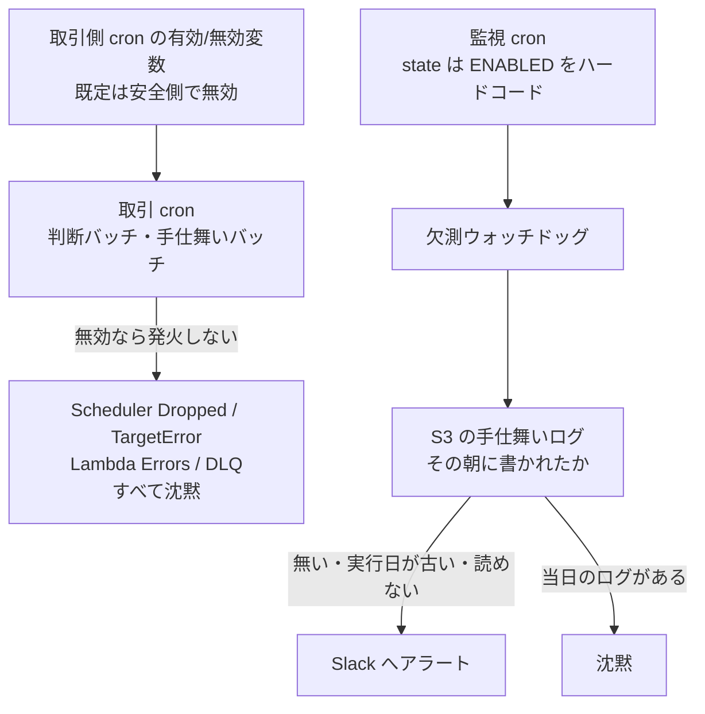
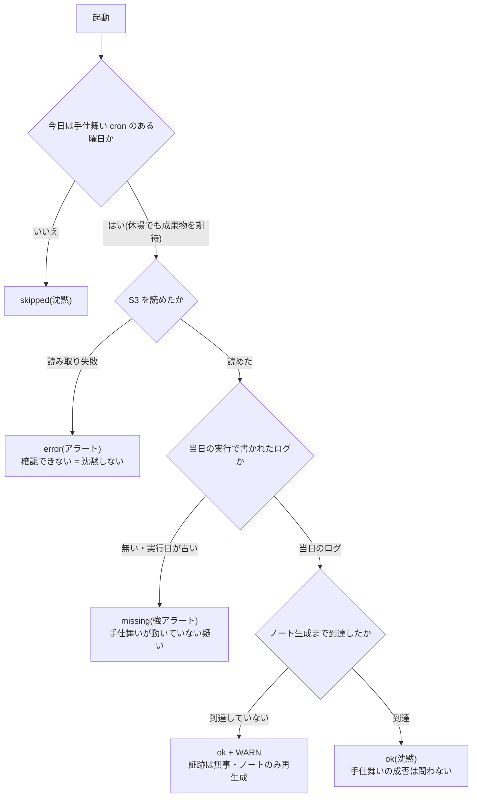

## TL;DR

- CloudWatch で組んだ監視の多くは「**起動したが失敗した**」系です。EventBridge Scheduler が `DISABLED` だとそもそも発火しないので、`InvocationDroppedCount` も Lambda の `Errors` も DLQ も**すべて沈黙**します
- 欠測を見る Lambda を足しても、そのスケジュールが取引側 cron と**同じ有効/無効変数**に乗っていると、事故の再現で監視ごと止まります。そこで監視スケジュールの `state` は `"ENABLED"` をハードコードし、**取引側だけを変数で止められる**非対称にしました
- 見る対象は Lambda の起動回数ではなく、**S3 にその朝書かれたはずの手仕舞いログ**です。存在するだけでは足りず、**実行日が当日と一致すること**まで確認します

## 前提: システム概要と制約条件

GMOコインFX の API を使う自動売買システム(AWS Lambda + Python)です。定時の判断バッチが動いて発注し、翌日の定時に手仕舞いバッチが全建玉を決済します。どちらも EventBridge Scheduler の cron で起動します。

監視は CloudWatch Alarm → SNS → Slack で、次を見ていました。

- Scheduler の `InvocationDroppedCount` / `TargetErrorCount`
- 各バッチ Lambda の `Errors`(未捕捉例外)
- Scheduler の DLQ にメッセージが滞留していないか
- アプリ内エラーログ(構造化ログの `level = "error"`)のメトリクスフィルタ

制約条件は次のとおりです。

- Scheduler の `state` は Terraform 変数で切り替えます。既定は安全側の `DISABLED` です。口座やシークレットの準備が整う前に `apply` しただけで走り出さないようにするための既定値です
- 手仕舞いバッチが止まっても、GMO 側の決済 OCO(TP/SL)は生きているので、建玉が即座に無防備になるわけではありません。ただし**時間切れでの手仕舞いが機能せず、保有時間の上限という前提が崩れます**
- 停止に気づくのは翌朝の手動確認です。つまり最悪、丸一日近く気づけません

そして実際に、`terraform apply` の際の変数の付け忘れで**取引側 cron が既定の `DISABLED` に落ち得る状態**を踏みました。設定自体はすぐ直せます。

問題は、その状態では上に並べた監視が**1つも鳴らない**ことでした。すべて「起動した」ことを前提にしているからです。この記事は、そこを埋めるために足した**欠測ウォッチドッグ**の設計です。

## 設計の全体像

ウォッチドッグは手仕舞いバッチの少しあとに起動し、その朝の手仕舞いログが S3 にあるかだけを見ます。重要なのは Lambda の中身より、**そのスケジュールが取引側と別の系統に置かれている**ことです。



左の系統(取引 cron)は止められてよい。右の系統(監視 cron)は止められては困る。この**非対称をインフラ定義のレベルで固定する**のが設計の中心です。

## 各要素の解説

### 監視スケジュールの state は "ENABLED" をハードコードする

Terraform では、取引側の2つの cron を `for_each` でまとめて定義していました。ウォッチドッグを足すとき、**同じ `for_each` に1エントリ増やすのが最短**です。しかしそれをすると `state` を共有し、事故が再現したときに監視も一緒に止まります。

そこで locals もリソースも分けました。

```hcl
locals {
  # 取引側の cron。安全側に倒したいときは変数で止める
  schedules = {
    decision = { target_fn = "decision", expression = "cron(...)" }
    closeout = { target_fn = "closeout", expression = "cron(...)" }
  }

  # 監視の cron は取引側とは別リソースで定義する。
  # 同じ for_each に入れると state を共有し、
  # 「取引 cron が止まる」事故で監視ごと沈黙する
  watchdog_schedules = {
    closeout_watchdog = { target_fn = "closeout_watchdog", expression = "cron(...)" }
  }
}

resource "aws_scheduler_schedule" "this" {
  for_each = local.schedules
  state    = var.schedule_state # 取引側は変数で止められる(既定は安全側)
  # ...
}

resource "aws_scheduler_schedule" "watchdog" {
  for_each = local.watchdog_schedules
  state    = "ENABLED" # 変数を参照しない。ここが本設計の核心
  # ...
}
```

`state` に変数を使うのは一見して「設定可能で良い設計」に見えます。しかし監視にとっては、**取引側と運命を共有する**という意味になります。ウォッチドッグは事故そのもの(cron が無効になっている)を検知するためのものなので、同じスイッチの下に置いた時点で役に立ちません。

### Scheduler の invoke 権限にウォッチドッグを含める

`state` を独立させても、Scheduler が Lambda を呼べなければ同じことです。invoke 権限のリソース列挙は取引側の `for_each` から組み立てていたので、そこに監視側も足しました。

```hcl
resources = [
  for k in distinct(concat(
    [for s in local.schedules : s.target_fn],
    [for s in local.watchdog_schedules : s.target_fn], # 含め忘れると監視が沈黙する
  )) : aws_lambda_function.this[k].arn
]
```

含め忘れると「スケジュールは発火しているのに Lambda に到達しない」状態になります。ウォッチドッグの場合、これは**アラートが出ないだけ**なので、正常時と見分けがつきません。

### 見るのは起動回数ではなく S3 の成果物

ウォッチドッグの判定材料は、手仕舞いバッチが対象取引日ごとに書く S3 のログ(`logs/closeout/<対象取引日>.json`)です。Lambda の `Invocations` メトリクスを見る手もありますが、それだと「起動したが成果物を書けなかった」を取りこぼします。

「動いたか」ではなく「**その朝の仕事が終わっているか**」を見たいので、判定は成果物の側に置きました。

### 存在チェックでは足りない — 実行日まで見る

手仕舞いバッチもウォッチドッグも、対象取引日を「直近の確定取引日」として、土日・休場日を逆順に遡って求めます。ここに落とし穴があります。**休場が挟まると、別々の日の実行が同じ対象取引日に解決する**ことがあります。

その場合、前回の実行が書いたログが既に S3 にあります。存在チェックだけだと、当日の実行が丸ごと失敗していても「ログはある」で素通りしてしまいます。

そこで、ログの中の**バッチ実行日**まで見ます。

```python
def _is_fresh(log: dict[str, Any], today: date) -> bool:
    """ログが**その朝の実行**で書かれたものかを判定する。

    存在チェックだけでは不十分。対象取引日の解決は休場を遡るため、
    休場をまたぐと前回の実行が書いた同じキーのログが既に存在する。
    """
    return log.get("run_date") == today.isoformat()
```

`run_date`(バッチ実行日)は監査用に元から payload に入れていたフィールドで、対象取引日(`date`)とは別物です。この2つを混同すると、そのまま検知漏れになります。

対象取引日の解決規則が手仕舞いバッチとウォッチドッグでずれると、別の日のログを見に行って**見逃しか誤検知のどちらか**になります。そこで、連続する30日ぶんの日付を流して両者が同じ日付を返すことをテストで固定しています。

### 休場日でもスキップしない

「公式の市場ステータスが取れるなら、休場の朝は手仕舞いもウォッチドッグも休めばよい」と思いがちです。判断バッチは実際、自前の休場カレンダーで先頭から早期 return します。休場に新規を出さないためです。

手仕舞いバッチは同じことをしません。朝のジョブは「今日エントリーしてよいか」ではなく、「昨夜までの建玉を畳めるか」だからです。カレンダーで黙って帰ると、閉場でもアラートも次の定時への再試行も残りません。

公式ステータスは、決済シーケンスの先頭で既に見ています。開いていなければ cancel / close の POST は送りません。ただしジョブ全体を成功扱いで終わらせません。

閉場は「今日は仕事なし」ではなく「今は決済できない」です。アラートを出して次の定時で再試行し、その結果も実行日付きで S3 に残します。開閉の正を公式ステータスに置く話は [閉場なのに建玉取得が通った話](https://zenn.dev/ozapon/articles/gmo-fx-market-status-closed) に書きました。

ウォッチドッグが休場でも動くのは、その帰結です。手仕舞い cron のある朝は成果物があるはずなので、監視だけ休むと「その朝に取引 cron だけ止まっていた」を見逃します。スキップするのは、そもそも手仕舞い cron が無い曜日だけです。

### 読めないときは黙らない(fail-closed)

S3 の読み取りに失敗したとき、それは「ログが無い」ことを意味しません。しかし「**ある**」ことも確認できていません。ここは沈黙せずアラートに倒しました。

```python
try:
    log = s3_logger.load_closeout_log(prev_trade_date)
except Exception as exc:
    # 読めない ＝「無い」ではないが、確認できない時点で沈黙してはいけない。
    # 手仕舞いが動いていない可能性を潰せないため fail-closed でアラートする
    logger.error("closeout_watchdog_read_failed", extra={"error": str(exc)})
    send_slack_alert("[ALERT] 手仕舞いログを確認できません(S3 読み取りエラー)")
    return {"status": "error", "reason": "s3_read_failed"}
```

判定不能を安全側に倒す考え方は、非常停止で「成功と誤認しない」ために採ったものと同じです([Kill Switch の記事](https://zenn.dev/ozapon/articles/gmo-fx-kill-switch-idempotency))。監視では、誤検知1回のコストより沈黙1回のコストのほうが重い、という非対称がはっきりしています。

### 手仕舞いが失敗していても、ウォッチドッグは黙る

当日のログがあれば、その `status` が失敗を示していてもウォッチドッグはアラートを出しません。**実行されたかどうかだけ**が責務だからです。決済に失敗した日は手仕舞いバッチ自身が強いアラートを出すので、ここで重ねると「どちらを見ればよいか」が曖昧になります。

テストは「アラートを出すべきときに出す」だけでなく、この「**出すべきでないときに黙る**」側も固定しています。誤発火が続くと運用者がアラートを無視するようになり、結局は沈黙と同じになるためです。

### ノートが無い日は WARN にとどめる

手仕舞いバッチは、LLM でトレードノートを生成する前に**証跡を先に S3 へ書きます**。LLM 呼び出しがハングして Lambda が落ちても、約定明細を失わないためです。このとき「あとで確定版に上書きする」印を立て、確定版の保存で消します。

ウォッチドッグは当日のログを見つけたあと、この印が残っていないかも見ます。残っていれば「手仕舞いは終わったが、ノート生成に到達しなかった」日です。

ただし返す `status` は `ok` のままにし、Slack も WARN 文面にとどめます。建玉・注文への影響は無く、約定明細もログに残っていて、必要なのはノート本文の再生成だけだからです。主契約(欠測検知)と副次シグナルを同じ強さで出すと、緊急対応に人を走らせてしまいます。

### 監視自身の異常はどう拾うか

ウォッチドッグは欠測を検知したとき、自分で `logger.error` を出します。そのため、アプリ内エラーログのメトリクスフィルタ対象に**含めていません**。含めると、正常にアラートしただけで二重に通知が飛びます。

一方、Lambda の `Errors`(未捕捉例外)アラームには**含めています**。Slack 送信の手前で例外になるとウォッチドッグは何も通知できないので、監視自身が落ちたときに沈黙しない経路が要ります。同じ関数でも「アプリとしてのエラー」と「関数が落ちた」は別物で、監視コンポーネントでは前者が正常動作、後者が異常です。

### 判定フロー全体



## 設計判断: 代替案とトレードオフ

### 案A: 取引側と同じ for_each / 同じ有効化変数に乗せる → 不採用

定義は最小になりますが、**事故の再現で監視ごと止まります**。埋めようとした穴がそのまま復活するので、監視としての価値がゼロになります。

厄介なのは、これが「便利だからまとめよう」という将来のリファクタで静かに壊れる種類の性質だという点です。壊れても平常時は何も起きず、事故のときだけ効かない。そこで、インフラ定義そのものをテストで固定しました。

```python
# 抜粋。実際は Terraform ファイルから該当ブロックを正規表現で切り出している
def test_watchdog_state_is_hardcoded_enabled() -> None:
    """state は "ENABLED" リテラル。取引側の変数を参照しないこと。"""
    value = _state_value(_resource_block("watchdog"))
    assert value == '"ENABLED"'

def test_watchdog_is_not_in_trading_for_each() -> None:
    """watchdog を取引側の locals に混ぜないこと(混ぜると state を共有する)。"""
    assert "watchdog" not in _locals_block("schedules")
```

テストは Terraform ファイルをテキストとして読み、`state` の値と for_each の中身を突き合わせているだけです。`plan` も `apply` も要らないので CI で常に回ります。同じ要領で、Scheduler の invoke 権限の列挙に監視側が含まれていることも固定しています。

### 案B: 監視も含めて全 cron を ENABLED 固定にする → 不採用

「変数で止められること自体が事故の原因なら、固定してしまえばよい」という案です。採らなかったのは、**止めたいときに取引側を止められなくなる**からです。準備が整うまで発注系を走らせない、という安全側の既定はそれ自体が必要な仕組みです。

必要なのは「全部止められない」ことではなく、「**止めてよいもの**と**止めてはいけないもの**を分ける」ことでした。

同じシステムでも、誤発注を封じ込める側は既定で遮断、非常停止は確実に動く、という非対称を作っています([two-key の設計](https://zenn.dev/ozapon/articles/gmo-fx-order-containment))。安全側に倒す対象を取り違えないことが重要です。

そのため、取引側が従来どおり変数を参照したままであることも、上のテストで一緒に固定しています。ウォッチドッグを固定した副作用で取引側まで固定されると、逆向きの事故になります。

### 案C: Lambda の Invocations メトリクスだけを見る → 不採用

新しい Lambda も S3 の読み取りも要らず、CloudWatch のアラーム1本で済みます。ただし見えるのは「起動したか」までで、起動したが途中で落ちて成果物を書けなかった日は正常として通過します。知りたいのは「その朝の手仕舞いが終わっているか」なので、判定は成果物側に置きました。

### 案D: オブジェクトの存在チェックだけにする → 不採用

実装は比較1行ぶん短くなります。しかし前述のとおり、休場をまたぐと前回の実行が書いた同じキーのログが残っていて、それで素通りします。**存在チェックが通る条件と、その朝に実行された条件がイコールではない**、という一点に尽きます。

### 案E: 休場日はウォッチドッグをスキップする → 不採用

誤発火は減ります。しかし手仕舞い側は休場でも「畳めなかった」痕跡を残すので、監視だけ休むと期待がずれます。スキップした日は「取引 cron だけ止まっていても検知しない日」になり、監視の穴を曜日単位で開けることになります。カレンダーを監視にも複製すると、「今日は動くべきか」の情報源が二つになり、片方だけ直したときに穴が戻ります。

## まとめ

- 「起動したが失敗した」を見る監視は、**起動していない**事故を検知できません。スケジューラが無効なら、`Dropped`・`Errors`・DLQ はすべて正常に見えます
- 欠測を見るコンポーネントを足すときは、**それ自身が事故の巻き添えにならないか**を確認します。同じ有効/無効変数や同じ `for_each` に乗せた時点で、監視は事故と運命を共有します。ロール自体は取引側と共有してかまいませんが、**invoke 対象の列挙から漏れれば同じこと**です
- 止めてよいものと止めてはいけないものを**インフラ定義のレベルで非対称にし、その非対称をテストで固定**します。平常時は誰も気づけない性質なので、レビューの記憶ではなく CI に守らせます
- 判定材料は起動記録ではなく**成果物**にし、存在だけでなく**いつ書かれたか**まで見ます。確認できないときは沈黙せずアラートに倒します

同じシステムの非常停止の設計は[GMOコインFX 自動売買の非常停止(Kill Switch)](https://zenn.dev/ozapon/articles/gmo-fx-kill-switch-idempotency)、開発中に誤発注を出さないための封じ込めは[テスト環境のない本番APIで誤発注を封じ込める設計](https://zenn.dev/ozapon/articles/gmo-fx-order-containment)、決済シーケンス先頭の閉場判定は[閉場なのに建玉取得が通った話](https://zenn.dev/ozapon/articles/gmo-fx-market-status-closed)に書いています。

手仕舞いの上流で発注価格をどう作っているかは[LLMに損切り価格を出させない設計](https://zenn.dev/ozapon/articles/gmo-fx-llm-sl-python)、API 呼び出しの流量制御は[GMOコインFX APIのレートリミットをクライアント側で強制する設計](https://zenn.dev/ozapon/articles/gmo-fx-rate-limiter)に書いています。
