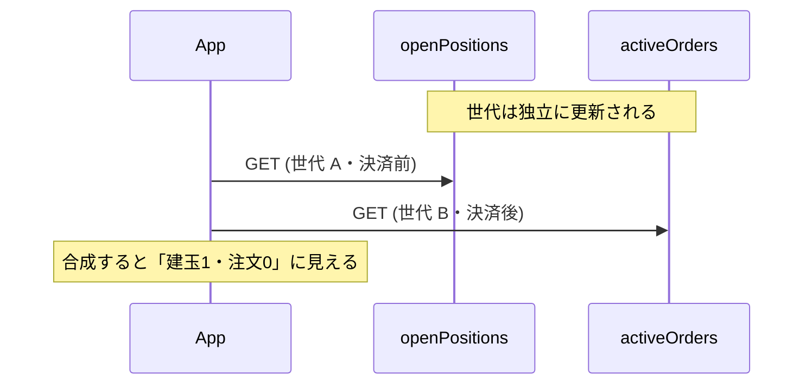

## TL;DR

- 当初は「決済 OCO が残ったまま満額 `closeOrder` すると ERR-423 の後半条件に触れる」を cancel-first 順序の設計根拠にしていました。**2026-08-11 の実発注スパイクでこの仮説は否定されました**
- 確定スコープは `settlePosition` / **MARKET** / **満額** / **単一建玉** / 開場中 / IFD-OCO の `settleType=CLOSE` 残存です。この条件で n=2、いずれも `status: 0` / `status: "EXECUTED"`。ERR-423 / ERR-200 / ERR-189 は出ませんでした
- 同一セッションの対照で建玉の 2 倍 `size` を送ると **ERR-189** `"Exceeds the order quantity."` でした。この経路では ERR-189 は**建玉 `size` の超過**で発火し、`orderedSize` を差し引いた残枠としては見ていません
- 副産物として、参照系 GET は**同一スナップショットを再利用**し、`openPositions` と `activeOrders` は**独立にドリフト**します。2 つの参照系 GET を突き合わせて状態を判断してはいけません
- ポーリング上限(最大約 4 秒)も cancel-first の順序も**変えませんでした**。変えたのは因果の説明だけです

決済シーケンス全体は [Kill Switch の冪等設計](https://zenn.dev/ozapon/articles/gmo-fx-kill-switch-idempotency) に書いています。本記事はその中の「ERR-423 仮説の否定」と「取消反映待ちの測り方」を掘り下げた枝葉です。

## 背景

GMOコインFX の API を使う自動売買システム(Python / AWS Lambda)で、全建玉を手仕舞いするシーケンスを実装しています。定時手仕舞いバッチと非常停止(Kill Switch)が共有する処理です。

このシーケンスは「**キャンセル・ファースト**」と呼んでいる順序規約で動きます。決済の前に必ず未約定注文を取り消す、という規約です。

- Step1: 新規注文(`settleType` が `OPEN`)のキャンセル
- Step2: 決済注文(`settleType` が `CLOSE`、実体は決済 OCO)のキャンセル
- Step3: 残った建玉を `closeOrder` で成行クローズ

Step3 は `closeOrder` の `settlePosition` 配列(最大10件)で建玉を指定します。FX API 側に `closeBulkOrder` は無いため、一括決済はこの形になります(2026年8月時点)。

当初の設計根拠は、公式エラー表の **ERR-423 後半条件**でした。決済 OCO が有効注文として枠を押さえたまま満額決済すると、「総有効注文数量との合計が総建玉数量よりも大きい場合」に触れる、と考えていました。

その前提で Step2 と Step3 のあいだに、建玉の `orderedSize`(注文中数量)が `"0"` になるまでの短ポーリングを入れていました。ただし **ERR-423 自体は、当時のスパイクでは一度も観測していませんでした**。

## 問題: 仮説を実測で潰す必要があった

公式のエラーコード表には、数量まわりで文言の近いコードが並んでいます(原文・2026-08-11 参照・`curl` でページ全文を取得)。

| コード | 原文 |
|---|---|
| ERR-189 | 決済注文において、決済可能保有数量を超えての数量の注文の場合に返ってきます。 |
| ERR-200 | すでに有効注文があり、注文数量が発注可能な数量を超えている場合に返ってきます。決済注文を行いたい場合は、注文数量を変更するか、有効注文を取消したうえで、再度注文をしてください。 |
| ERR-423 | 決済注文において注文数量が(指定した建玉、もしくは指定銘柄の建玉の)総建玉数量よりも大きい場合、もしくは総有効注文数量との合計が総建玉数量よりも大きい場合に返ってきます。 |

ERR-189 は 2026-07-30 時点の突合では「表に見当たらない」と記録していましたが、2026-08-11 の再確認では記載がありました。公式ドキュメントは更新されます。

2026-08-03 のスパイクでは、建玉数量より明らかに大きい `size` を送ったとき返ってきたのは **ERR-189** でした。ERR-423 の前半条件(数量超過)を狙ったつもりが別コードだった、という経緯があります。

一方、後半条件(有効注文枠)を狙った実験は未実施のままでした。`cancel_first.py` は「`orderedSize != 0` のまま close すると ERR-423 になり得る」と読んでいたため、**返ってくるコードそのものを一次情報として取る**必要がありました。

あわせて、取消反映待ちの上限 `_ORDERED_SIZE_POLL_MAX_ATTEMPTS = 5`(最大約 4 秒)にも強い根拠がありませんでした。先行観測は「かなり時間が経ってから確認したら反映済みだった」という粗い 1 件だけです。

## 実験1: ERR-423 は出なかった(n=2)

### 条件と操作

2026-08-11・USD_JPY・**100 通貨**・開場中・東京時間です。

目標状態は「1次約定済み + 決済 OCO 残存 + `orderedSize == "100"`」です。IFD-OCO のエントリーが約定すると、決済 OCO(TP LIMIT / SL STOP)が建玉数量を押さえるので `orderedSize` が `"100"` になります。

この状態で、`cancelOrders` を**呼ばずに**建玉満額(`size="100"`)の `closeOrder` を `settlePosition` で送信しました。

### 結果

2 サイクルとも同一結果です。

- HTTP 200 / body `status: 0`
- `data[0].status: "EXECUTED"`(即時約定)
- **ERR-423 / ERR-200 / ERR-189 いずれもなし**

実測レスポンスの一例です(`data` は配列)。

```json
{
  "status": 0,
  "data": [{
    "executionType": "MARKET",
    "orderId": <orderId>,
    "orderType": "NORMAL",
    "rootOrderId": <rootOrderId>,
    "settleType": "CLOSE",
    "side": "SELL",
    "size": "100",
    "status": "EXECUTED",
    "symbol": "USD_JPY",
    "timestamp": "2026-08-11T03:37:48.570Z"
  }],
  "responsetime": "2026-08-11T03:37:48.593Z"
}
```

事前状態の一例は、`positionId` 1 件・`size="100"`・`orderedSize="100"`・`activeOrders` 2 件(TP LIMIT + SL STOP、同一の親注文ID)でした。

### 対照: 建玉の 2 倍 `size` は ERR-189

同一セッションで、送信 `size` だけを `"200"`(建玉の 2 倍)に変えた対照を撃ちました。

| 送った size | 結果 |
|---|---|
| `"100"`(= 建玉 size) | `status:0` / `EXECUTED`(サイクル1・2) |
| `"200"`(= 建玉 size × 2) | **ERR-189** `"Exceeds the order quantity."`(サイクル2)・建玉は無傷 |

もし判定が `size - orderedSize`(= 0)に対して行われていれば、満額の `"100"` も ERR-189 になったはずです。ならなかったので、次が言えます。

> この経路では ERR-189 は「**建玉 `size` の超過**」で発火し、`orderedSize`(有効注文が押さえている分)を差し引いた残枠としては見ていない。

公式用語「決済可能保有数量」の一般定義が常に建玉 `size` である、とまでは言えません。ここで確定したのは**この経路の観測事実**です。

### 確定のスコープ(ここを外れる主張はしない)

| 条件 | 値 |
|---|---|
| 決済方式 | `settlePosition` |
| `executionType` | **`MARKET`** |
| 数量 | **満額**(送信 size == 建玉 size) |
| 建玉数 | **単一**(1 建玉 / 1 親注文ID) |
| 有効注文 | IFD-OCO の `settleType=CLOSE` 2 件が残存 |
| 市場 | 開場中 |

**未検証**: 分割決済(size < 建玉)、複数建玉 / 複数 root、`LIMIT`/`STOP` 決済、閉場前後、高ボラティリティ時。

「ERR-423 の後半条件は常に嘘」「あらゆる決済で有効注文は無視される」とは言いません。対外的な表現は **「現行本番パス(MARKET・満額・単一建玉)では仮説が外れた」**までです。

機序の解釈(例: 後半条件の「総有効注文数量」に `settleType=CLOSE` が数えられていない、など)は**未検証**です。観測(エラーが出ない)は n=2 で確定ですが、理由の断定は追試待ちです。

## 実験2: 取消反映の上限と、より面白い副産物

実験1 が即時約定するため、同じサイクルでは取消遅延を測れません。実験2 は専用サイクルで、`cancelOrders` 受付(t0)から `orderedSize == "0"` までを 500ms 間隔でポーリングしました。東京 3 + ロンドン 1 サイクルです。

### 上限 `U`(真の遅延の点推定ではない)

| cycle | セッション | 上限 `U` |
|---|---|---|
| 1 | 東京 | ≤1.524s |
| 2 | 東京 | ≤0.816s |
| 3 | 東京 | ≤0.769s |
| 4 | ロンドン | ≤1.515s |

4 サイクルとも、取消後の次世代スナップショットは t0 から約 1.5 秒以内に `orderedSize=0` を示しました。**`D > 4` 秒を示唆する事象はありません**。

ただし `U` の扱いを誤ると記事が壊れます。記号を置くと、t0 = cancel 受付、`T_prev` = t0 時点で最新のスナップショット、`T_next` = 最初の「取消後」スナップショット、`D` = 真の遅延です。

```
U = T_next − t0 = (T_next − T_prev) − (t0 − T_prev) = 世代間隔 − 古さ
```

これは**恒等式**です。`U` の値とばらつきは**ほぼスナップショットの幾何で決まり、`D` の点推定には使えません**。それでも各試行は **`D ≤ U` という弱い上界**としては有効です。「`U` は情報を含まない」は言い過ぎです(レビューで一度書いて訂正しました)。

東京とロンドンで `U` とスナップショット挙動に差は見えませんでした。ただし **`D` 自体の時間帯差までは言えません**(`D` を分離できていないため)。高ボラ時も未検証です。

### 副産物: 参照系 GET は同一スナップショットを再利用する

ここが記事的には一番価値が高い可能性があります。

ローカルで **690ms 離れた 2 回の GET** が、同一 `responsetime` かつ同一内容を返しました。

| poll | ローカル経過 | `positions_responsetime` | 観測 |
|---|---|---|---|
| 1 | 0.129s | `04:17:43.744Z` | `orderedSize=100` |
| 2 | 0.819s | **同一** | 同上 |
| 3 | 1.527s | `04:17:45.451Z` | `orderedSize=0` |

ここから言えることと、言えないことを分けます。

- ✅ **確定**: `responsetime` は「その HTTP リクエストの処理完了時刻」ではない
- ⚠️ **未検証**: 機序が「キャッシュ」かどうか。同一バッチ受付時刻・リードレプリカの sticky な版などでも同じ観測になります。本記事では「**同一スナップショットの再利用**」と呼び、機序は断定しません

世代間隔は **0.690〜1.736 秒**でばらつきます(固定周期ではない。散文では「約 0.7〜1.7 秒」)。

実装への含意は 3 点です。

1. ポーリング間隔を細かくしても分解能は上がらない(律速はサーバ側)
2. `orderedSize` と `activeOrders` の「反映速度の差」に見えるものは**アーティファクト**(片方のスナップショットが未更新なだけ)
3. **`openPositions` と `activeOrders` は独立にドリフトする**(n=3)。決済済みの建玉が「残っている」ように見える合成像が出ます。**2 つの参照系 GET を突き合わせて状態を判断してはいけません**

取消反映の判定に `activeOrders` 件数ではなく単一エンドポイントの `orderedSize` を使う設計は、この点で正しいままです。



## 解決策: 定数も順序も変えず、因果だけ書き換えた

### ポーリング上限は据え置き

`_ORDERED_SIZE_POLL_MAX_ATTEMPTS = 5`(最大約 4 秒)と間隔 1.0 秒は変更しませんでした。根拠は次の 4 点です。

1. 全 4 試行で、取消後の次世代スナップショットは常に t0 から約 1.5 秒以内
2. `U` の中身はほぼ幾何だが、`D > 4` 秒を示唆する事象は一度も無い
3. 間隔を 0.5 秒にしても世代境界より細かくは測れない
4. `D` の点推定を狙う改修は、分解能の下限が世代間隔なので費用対効果が低い

従来の「根拠が弱いから据え置き」から、「観測できる範囲では 4 秒を脅かす信号が無く、測れる量の性質も分かった上で据え置き」へ更新できました。これがスパイクの実質的な成果です。

抜粋です(ログは省略)。

```python
# 取消は「受付」であり反映は非同期。
# 待つ理由(2026-08-11 実測で更新):
#   1. Step3 が扱う状態を単純にする
#   2. TP/SL の約定と close のレースを避ける
# 枠超過拒否は本経路(MARKET/満額/単一建玉)では再現しなかった。
_ORDERED_SIZE_POLL_MAX_ATTEMPTS = 5
_ORDERED_SIZE_POLL_INTERVAL_SECONDS = 1.0


def _fetch_positions_after_cancel_reflection(
    client, symbol: str, *, cancelled_in_step2: bool
) -> list[dict]:
    positions = _fetch_open_positions(client, symbol)
    if not cancelled_in_step2 or not positions:
        return positions

    for attempt in range(1, _ORDERED_SIZE_POLL_MAX_ATTEMPTS + 1):
        pending = [p for p in positions if _is_nonzero_size(p.get("orderedSize"))]
        if not pending:
            return positions
        if attempt == _ORDERED_SIZE_POLL_MAX_ATTEMPTS:
            break
        time.sleep(_ORDERED_SIZE_POLL_INTERVAL_SECONDS)
        positions = _fetch_open_positions(client, symbol)

    # タイムアウトしても例外にはしない。満額 close を試み、失敗は次回起動に委ねる
    return positions
```

### cancel-first の順序も外していない

実測は「順序を守らなくても close できる」を示しましたが、外していません。理由は 3 点です。

1. **観測スコープが狭い**(上記の確定範囲のみ)
2. **失敗の非対称性** — 守るコストは POST 2 回(≒2 秒)。外して条件付きで拒否されると、**SL/TP を消した建玉が翌朝まで無防備に残る**
3. **Step2 には ERR-423 回避以外の価値がある** — 未約定注文の整理、TP/SL 約定とのレース回避、再送ゲートの二重受付抑止

本番コードは**因果の説明だけを書き換え、制御フローは変えませんでした**。

## まとめ

- 「決済 OCO 残存 + 満額 close = ERR-423」という仮説は、現行本番パス(MARKET・満額・単一建玉・開場中)では**否定**されました(n=2)
- 同経路の数量超過は ERR-189 で、建玉 `size` 超過として発火し、`orderedSize` 控除としては見えませんでした
- 参照系 GET は同一スナップショットを再利用し、世代間隔は約 0.7〜1.7 秒です。`openPositions` と `activeOrders` の突き合わせは合成像を生みます
- 取消反映の上限 `U` は幾何の副産物なので `D` の点推定には使えませんが、弱い上界としては有効です。4 秒を脅かす信号は無く、定数は据え置きました
- cancel-first の順序も据え置きです。変えたのは「なぜ待つか」の説明だけです

決済シーケンス全体(冪等性・fail-closed・決済後の残存判別)は [Kill Switch の冪等設計](https://zenn.dev/ozapon/articles/gmo-fx-kill-switch-idempotency)、POST 間隔を含むレート制御は [レートリミット設計](https://zenn.dev/ozapon/articles/gmo-fx-rate-limiter) に書いています。同じ「HTTP 200 + ボディ `status`」を参照系で踏んだ話は [約定が0件に化けた記事](https://zenn.dev/ozapon/articles/gmo-fx-http200-empty-executions)、発注ボディの数量型は [ERR-5105 の記事](https://zenn.dev/ozapon/articles/gmo-fx-err5105-ifo-size) にあります。
