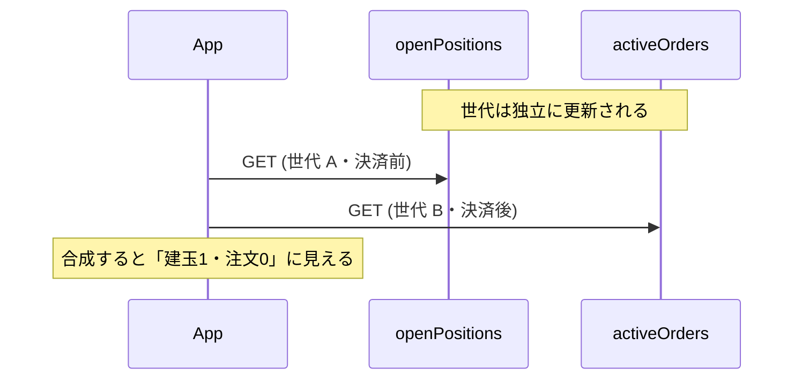

## TL;DR

- 手仕舞い前に有効注文を取り消す **cancel-first** を組むとき、公式の **ERR-423**(総有効注文数量との合計超過)を設計根拠にしやすいです。自分もそう読んでいました
- ただし `settlePosition` / **MARKET** / **満額** / **単一建玉** / 開場中という条件では、決済 OCO が `orderedSize` 満額で残ったまま `closeOrder` しても、**エラーにはならず即時約定**しました(n=2)。ERR-423 / ERR-200 / ERR-189 は出ません
- 同じ建玉で `size` だけ 2 倍にすると **ERR-189** `"Exceeds the order quantity."` です。この経路の ERR-189 は建玉 `size` の超過で発火し、`orderedSize` を差し引いた残枠としては見えません
- 取消反映を測る過程で、参照系 GET が**同一スナップショットを再利用**すること、`openPositions` と `activeOrders` が**独立にドリフト**することも分かりました。2 つの GET を突き合わせて状態判断してはいけません
- それでも cancel-first の順序と、取消後の短ポーリング(最大約 4 秒)は残しています。変えたのは「なぜ待つか」の説明です

決済シーケンス全体は [Kill Switch の冪等設計](https://zenn.dev/ozapon/articles/gmo-fx-kill-switch-idempotency) にあります。本記事はその枝葉で、**決済前キャンセルの根拠**と**参照系 GET の読み方**に絞ります。

## 背景

GMOコインFX の API で自動売買(Python / AWS Lambda)を動かしており、定時手仕舞いと非常停止(Kill Switch)が同じ決済シーケンスを共有しています。

建玉を閉じる前に、未約定の新規注文と決済 OCO(利確・損切り)を先に取り消します。これを cancel-first と呼んでいます。

1. 新規注文(`settleType=OPEN`)のキャンセル
2. 決済注文(`settleType=CLOSE`、実体は決済 OCO)のキャンセル
3. 残った建玉を `closeOrder` で成行クローズ

一括決済は `closeOrder` の `settlePosition`(最大10件)です。FX API に `closeBulkOrder` はありません(2026年8月時点)。

公式エラー表を読むと、数量まわりに似た文言が並びます(原文・2026年8月時点で確認)。

| コード | 原文 |
|---|---|
| ERR-189 | 決済注文において、決済可能保有数量を超えての数量の注文の場合に返ってきます。 |
| ERR-200 | すでに有効注文があり、注文数量が発注可能な数量を超えている場合に返ってきます。決済注文を行いたい場合は、注文数量を変更するか、有効注文を取消したうえで、再度注文をしてください。 |
| ERR-423 | 決済注文において注文数量が(指定した建玉、もしくは指定銘柄の建玉の)総建玉数量よりも大きい場合、もしくは総有効注文数量との合計が総建玉数量よりも大きい場合に返ってきます。 |

ERR-423 の後半と ERR-200 は、どちらも「有効注文が枠を押さえている」話に読めます。ERR-200 は「有効注文を取消したうえで再度注文」とまで書いており、cancel-first そのものです。

自分は「決済 OCO が残ったまま満額 close すると ERR-423 になる」と読んで、Step2 と Step3 のあいだに建玉の `orderedSize`(注文中数量)が `"0"` になるまで待つ実装を入れました。ただし当時、その拒否コード自体は一度も採れていませんでした。

## 問題: 公式の読みと、実際に返るコードがずれる

数量超過を狙って建玉より大きい `size` を送ると、返ってくるのは ERR-423 ではなく **ERR-189** でした。前半条件の文言と実コードが一致しない、という時点で「表の読みだけで再送条件を決める」のは危ない、と感じていました。

では後半条件(有効注文枠)はどうか。公式どおりなら拒否が来るはずです。来なければ、待ちの根拠も書き換える必要があります。そこで実発注で確認しました。

## 実測: 有効注文が残っていても close が通る場合がある

### 条件

2026年8月・USD_JPY・100 通貨・開場中・東京時間です。

IFD-OCO のエントリーが約定すると、決済 OCO(TP LIMIT / SL STOP)が建玉数量を押さえ、`orderedSize` は `"100"` になります。この状態で **`cancelOrders` を呼ばず**、建玉満額の `closeOrder`(`settlePosition` / `MARKET`)を送りました。

### 結果(n=2・同一)

- HTTP 200 / body `status: 0`
- `data[0].status: "EXECUTED"`
- ERR-423 / ERR-200 / ERR-189 はいずれもなし

```json
{
  "status": 0,
  "data": [{
    "executionType": "MARKET",
    "orderId": <orderId>,
    "orderType": "NORMAL",
    "rootOrderId": <rootOrderId>,
    "settleType": "CLOSE",
    "side": "SELL",
    "size": "100",
    "status": "EXECUTED",
    "symbol": "USD_JPY",
    "timestamp": "2026-08-11T03:37:48.570Z"
  }],
  "responsetime": "2026-08-11T03:37:48.593Z"
}
```

事前状態は建玉 1 件・`size="100"`・`orderedSize="100"`・有効な決済 OCO 2 件です。

### 対照: 建玉の 2 倍は ERR-189

| 送った size | 結果 |
|---|---|
| `"100"`(= 建玉) | `status:0` / `EXECUTED` |
| `"200"`(= 建玉 × 2) | **ERR-189** `"Exceeds the order quantity."`(建玉は無傷) |

もしサーバが `size - orderedSize`(= 0)を見ているなら、満額 `"100"` も ERR-189 になるはずです。ならなかったので、**この経路では ERR-189 は建玉 `size` の超過で発火し、`orderedSize` 控除の残枠判定ではない**と言えます。

「決済可能保有数量」が常に建玉 `size` と同義、とまでは言いません。確定したのはこの経路の観測だけです。

### 言える範囲 / 言えない範囲

| 条件 | 値 |
|---|---|
| 決済方式 | `settlePosition` |
| `executionType` | **MARKET** |
| 数量 | **満額** |
| 建玉 | **単一** |
| 有効注文 | IFD-OCO の `settleType=CLOSE` が残存 |
| 市場 | 開場中 |

分割決済・複数建玉・`LIMIT`/`STOP` 決済・閉場前後・高ボラ時は未検証です。

「ERR-423 は出ない仕様」「有効注文は常に無視される」ではありません。**上記条件では、公式から予想した拒否が来なかった**、という一次情報です。なぜ来ないか(例: 後半条件の集計に CLOSE 注文が含まれるか)は未検証です。

## 取消反映を測ると見える、参照系 GET の落とし穴

cancel-first を残すなら、取消の**受付**と**反映**は別問題です。`cancelOrders` 成功直後の GET が取消前を返すことは、以前からありました。

そこで受付時刻(t0)から `orderedSize == "0"` になるまで 500ms 間隔でポーリングしました(東京 3 + ロンドン 1)。取消後の次世代スナップショットは、いずれも t0 から約 1.5 秒以内に `orderedSize=0` を示しました。最大約 4 秒の待ちを脅かす信号は出ていません。

ただし表に載る秒数を「真の反映遅延」と読むのは誤りです。観測できるのは、スナップショット世代が切り替わった時刻までの**上限**で、その値はおおむね「世代間隔 − t0 時点のスナップショットの古さ」で決まります。真の遅延の点推定には使えません。弱い上界としては使えます。

### 同一スナップショットの再利用

ローカルで 690ms 離れた 2 回の GET が、同一 `responsetime`・同一内容を返したことがあります。

| poll | ローカル経過 | `positions_responsetime` | 観測 |
|---|---|---|---|
| 1 | 0.129s | `04:17:43.744Z` | `orderedSize=100` |
| 2 | 0.819s | **同一** | 同上 |
| 3 | 1.527s | `04:17:45.451Z` | `orderedSize=0` |

`responsetime` は「その HTTP リクエストの処理完了時刻」ではありません。機序がキャッシュかどうかは断定しません(バッチ受付時刻や sticky な版でも同じ観測になります)。ここでは**同一スナップショットの再利用**と呼びます。

世代間隔は約 0.7〜1.7 秒でばらつきます(固定周期ではない)。

読者が実装に落とすなら、次の 3 点です。

1. ポーリングを細かくしても、分解能はサーバ側の世代更新が律速する
2. `orderedSize` と `activeOrders` の「反映速度の差」に見えるものは、片方のスナップショットが古いだけのことが多い
3. `openPositions` と `activeOrders` は独立にドリフトする(n=3)。決済済み建玉が残って見える合成像が出るので、**2 つの参照系 GET を突き合わせて判断しない**

反映待ちの判定は、単一エンドポイントの `orderedSize` に寄せています。



## 解決策: 順序と待ちは残し、根拠だけ書き換える

実測は「この条件なら順序を外しても close できる」を示しました。それでも順序は外していません。

1. 観測範囲が狭い(上記スコープのみ)
2. 守るコストは POST 2 回程度。外して条件付きで拒否されると、損切り・利確を消した建玉が次の手仕舞いまで無防備に残る
3. Step2 の価値は枠超過回避だけではない。未約定注文の整理、TP/SL との約定レース回避、再送時の二重受付抑止が残る

待ちの上限(5 回 × 1 秒 ≒ 4 秒)も据え置きです。全試行で次世代は約 1.5 秒以内、4 秒超を示唆する事象は無く、間隔を細かくしても世代境界より細かくは測れないためです。

```python
# 取消は「受付」であり反映は非同期。
# 待つ理由:
#   1. 決済前に状態を単純にする
#   2. TP/SL の約定と close のレースを避ける
# 枠超過拒否は本経路(MARKET/満額/単一建玉)では再現しなかった。
_ORDERED_SIZE_POLL_MAX_ATTEMPTS = 5
_ORDERED_SIZE_POLL_INTERVAL_SECONDS = 1.0


def _fetch_positions_after_cancel_reflection(
    client, symbol: str, *, cancelled_in_step2: bool
) -> list[dict]:
    positions = _fetch_open_positions(client, symbol)
    if not cancelled_in_step2 or not positions:
        return positions

    for attempt in range(1, _ORDERED_SIZE_POLL_MAX_ATTEMPTS + 1):
        pending = [p for p in positions if _is_nonzero_size(p.get("orderedSize"))]
        if not pending:
            return positions
        if attempt == _ORDERED_SIZE_POLL_MAX_ATTEMPTS:
            break
        time.sleep(_ORDERED_SIZE_POLL_INTERVAL_SECONDS)
        positions = _fetch_open_positions(client, symbol)

    # タイムアウトしても例外にはしない。満額 close を試み、失敗は次回起動に委ねる
    return positions
```

制御フローは変えず、コメントと設計ドキュメントの因果だけを実測に合わせました。

## まとめ

公式の拒否コードを cancel-first の根拠にするのは自然ですが、待たせる理由にはしません。順序と短ポーリングは残し、変えるのは「なぜ待つか」の説明です。

参照系 GET は同一スナップショットを再利用し、エンドポイント同士は独立にドリフトします。2つの GET を突き合わせて状態を作ってはいけません。

全体設計は [Kill Switch の冪等設計](https://zenn.dev/ozapon/articles/gmo-fx-kill-switch-idempotency)、レート制御は [レートリミット設計](https://zenn.dev/ozapon/articles/gmo-fx-rate-limiter)、参照系の HTTP 200 空配列化は [約定が0件に化けた記事](https://zenn.dev/ozapon/articles/gmo-fx-http200-empty-executions)、数量型は [ERR-5105 の記事](https://zenn.dev/ozapon/articles/gmo-fx-err5105-ifo-size) にあります。
