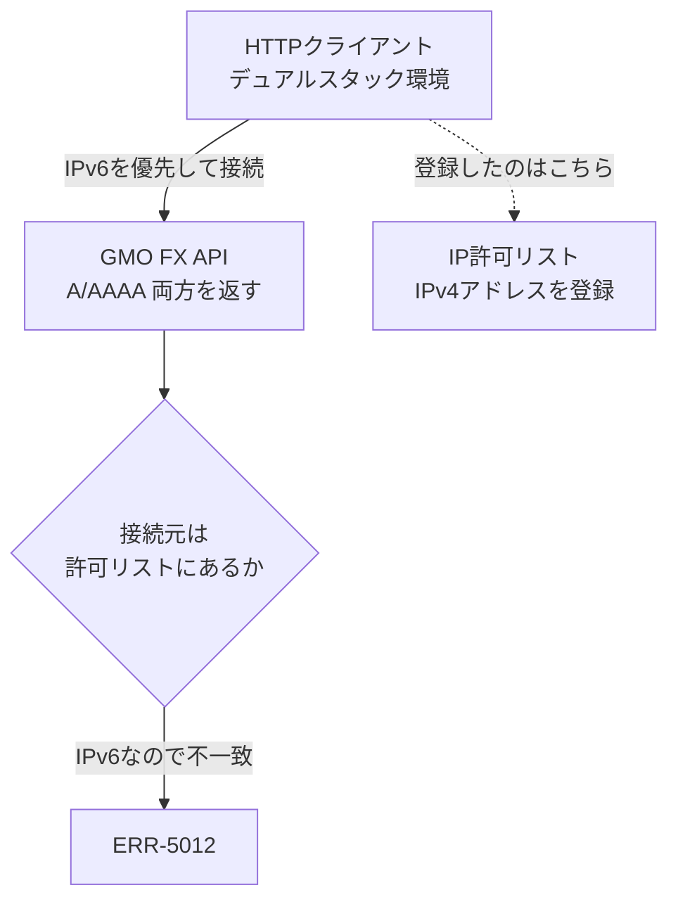

## TL;DR

- GMOコインFX の Private API で `ERR-5012: Invalid API-KEY, IP, or permissions for action.` が消えない。キーも権限も IP 許可リストもすべて正しく設定してあるのに、です
- 真因は **接続が IPv6 で出ていたこと**でした。API のホストは IPv4/IPv6 の両対応(dual-stack)で、HTTP クライアントが IPv6 を優先して接続する一方、許可リストに登録していたのは IPv4 アドレスだったため、サーバから見た接続元が許可外になっていました
- 解決策は接続元を IPv4 に固定すること。httpx なら `httpx.HTTPTransport(local_address="0.0.0.0")` です
- この問題は **IPv4 のみで外に出る本番環境(NAT Gateway 経由の Lambda など)では再現しません**。デュアルスタックなローカル開発機や一部の CI でだけ起きます

## 背景

GMOコインFX の API を使う自動売買システム(AWS Lambda + Python)を開発しており、最初の疎通確認として参照系の Private API(資産残高の取得)をローカルから叩いていました。

Private API は HMAC-SHA256 署名が必要で、署名まわりでも別の落とし穴を踏んでいます。そちらは [GMOコインFX APIのERR-5010でハマった話](https://zenn.dev/ozapon/articles/gmo-fx-hmac-sign-path) に書きました。本記事はその手前、そもそもリクエストが受け付けられない段階の話です。

## 問題

署名付きでリクエストすると、次のレスポンスが返り続けました。

```json
HTTP/1.1 200 OK

{
  "status": 1,
  "messages": [
    {
      "message_code": "ERR-5012",
      "message_string": "Invalid API-KEY, IP, or permissions for action."
    }
  ],
  "responsetime": "2026-06-29T07:17:16.725Z"
}
```

HTTP ステータスは 200 です。GMO の Private API は業務エラーでも HTTP 200 を返し、ボディの `status`(0=成功 / 0以外=エラー)で成否を表します。

厄介なのは `ERR-5012` の守備範囲の広さです。メッセージが示すとおり「API-KEY」「IP」「権限」の3つを1つのコードに束ねており、[公式ドキュメント](https://api.coin.z.com/fxdocs/)の説明も「API-KEYが認証エラーの場合など**に**返ってきます」と、それ自体が幅を持った書き方になっています。

実際、正しいキー・デタラメなキー・デタラメな署名のいずれで投げても**すべて同じ ERR-5012** になることを実測で確認しました。つまりエラーコードからは原因を切り分けられません。

ただしこれは、後述するとおり**接続元 IP が許可リストと不一致だった状態での観測**です。IP 不一致の段階で弾かれるとリクエストは署名の検証まで到達しないため、署名の正誤にかかわらず ERR-5012 になります。IP の問題を解消したあとは、署名が誤っていれば別のコード(`ERR-5010`)が返ります。

## 原因

### 疑わしい順に潰しても消えない

まず素直に、メッセージが名指ししている3つを順に確認しました。

1. **キーの値** — 会員ページの表示と桁数・先頭末尾を照合。改行や空白の混入もなし
2. **権限スコープ** — 参照系(資産残高の取得)が有効になっているか確認
3. **IP 許可リスト** — 自宅回線のグローバル IP を登録し、「更新する」で保存したことも確認

それでも消えませんでした。ここまでで約1時間が溶けています。

### 真因: リクエストが IPv6 で出ていた

行き詰まって、HTTP クライアントが**実際にどのアドレスから接続しているか**を確認したところ、原因が判明しました。接続が IPv6 で出ていたのです。

API のホストは IPv4/IPv6 の両方で名前解決できます(2026年7月時点)。

```console
$ dig +short A forex-api.coin.z.com
18.172.31.14
...

$ dig +short AAAA forex-api.coin.z.com
2600:9000:26a6:8c00:3:9cb4:a0c0:93a1
...
```

一方、デュアルスタック環境の HTTP クライアントは IPv6 を優先して接続します。httpx で実測すると次のとおりでした(アドレスの一部はマスクしています)。

```
① 既定の httpx.Client()
  接続先: ('2600:9000:26a6:e800:...', 443)  → IPv6
  接続元: ('2001:xxxx:xxxx:...', 58857)     → IPv6

② IPv4 強制 local_address='0.0.0.0'
  接続先: ('18.172.31.63', 443)             → IPv4
  接続元: ('192.168.xxx.xxx', 58866)        → IPv4
```

② の接続元 `192.168.xxx.xxx` は端末上のプライベートアドレスです。許可リストに登録するのは NAT 後の**グローバル IPv4**であり、`client_addr` の値そのものではありません。ここで見るのはアドレス系(IPv4 / IPv6)の判定です。

許可リストに登録していたのは**自宅回線の IPv4 アドレス**でした。しかし実際の接続は IPv6 で出ている。サーバから見れば「登録されていないアドレスからのアクセス」であり、IP 制限に弾かれて ERR-5012 になっていた、というのが真相です。



キーも権限も IP 登録も正しかったので、メッセージが名指しする3項目をいくら見直しても永久に見つからない構図でした。

なお公式ドキュメントには IP 制限機能そのものの説明(「会員ページにてIP制限機能を有効にすると、API呼出ができるIPアドレスを制限することができます」)はありますが、IPv4 と IPv6 の別への言及はありません(2026年7月時点、全文検索で確認)。

### 本番では再現しない

この問題の質が悪いところは、**環境によって出たり出なかったりする**点です。

AWS Lambda から NAT Gateway 経由で外に出る構成なら、egress は固定 EIP の IPv4 です。IPv6 で出る余地がないので、この問題は起きません。デュアルスタックなローカル開発機や一部の CI だけで発生します。

「ローカルでだけ通らない」「CI でだけ落ちる」という形で現れるため、コードやキーの問題だと思い込みやすい罠でした。

## 解決策

### 接続元を IPv4 に固定する

httpx なら、トランスポートに `local_address="0.0.0.0"` を渡します。これは「OS が選んだ IPv4 アドレスから送出する」という指定で、IPv6 での接続を抑止します。

```python
import httpx

# 送信元を IPv4 にバインドし、IPv6 egress を抑止する
transport = httpx.HTTPTransport(local_address="0.0.0.0")
client = httpx.Client(timeout=30.0, transport=transport)
```

クライアントを内部生成しているなら、生成箇所の既定にしておくのが安全です。環境ごとの挙動差を、コード側で吸収できます。

requests(urllib3)を使っている場合は、同等の指定として `source_address` を持つアダプタを噛ませる方法があります。

### 切り分け方: 実接続のアドレスを見る

同じ問題を疑ったときは、まず**実際の接続元/接続先アドレス**を確認するのが最短です。httpx ならレスポンスの拡張情報から取得できます。

```python
resp = client.get("https://forex-api.coin.z.com/public/v1/status")
stream = resp.extensions.get("network_stream")
print(stream.get_extra_info("server_addr"))  # 接続先
print(stream.get_extra_info("client_addr"))  # 接続元
```

署名不要の public エンドポイントで確認できるので、認証情報を用意する前に切り分けられます。接続先が `2600:...` のような IPv6 になっていたら、この問題を疑ってよいと思います。`client_addr` がプライベートアドレスでも問題なく、許可リスト用のグローバル IP とは別物として扱います。


`curl` なら `-4` / `-6` でアドレス系を明示的に切り替えられるため、両者で結果が変わるかを見るのも有効です。

### 許可リスト側を直す選択肢

もう一方の解として、IPv6 アドレスを許可リストに登録する方法も考えられます。ただし家庭用回線の IPv6 アドレスは変動することがあり、運用が安定しにくい面があります。今回は接続を IPv4 に固定する方を採りました。

## まとめ — ERR-5012 チェックリスト

`ERR-5012` は「キー無効 / IP不一致 / 権限不足」を1つに束ねたコードで、コードからは原因を区別できません。次の順に潰すのが効率的です。

1. **キーの値** — 会員ページの表示と一致するか。前後の空白・改行が混入していないか。テンプレートのプレースホルダのままになっていないか
2. **権限スコープ** — 使おうとしている操作(参照系/注文系)が API キーに付与されているか
3. **IP 許可リスト** — egress の IP が登録されているか。保存操作まで完了しているか
4. **接続元のアドレス系** — ここまでで消えないなら **IPv6 で出ていないか**を疑う。実接続のアドレスを確認し、IPv4 に固定して再試行する

逆に言えば、返ってくるコードが `ERR-5010`(署名が不正)に変わったなら、IP とキーのゲートは通過しています。5012 から 5010 に変わることは、切り分けが一段進んだ合図として使えます。

そして最後の項目は GMO に限った話ではありません。**IP 許可リスト方式の API + デュアルスタックのホスト + IPv6 を優先する HTTP クライアント**という条件が揃えば、同じことがどこでも起き得ます。「認証エラーなのにキーは正しい」というときは、ネットワーク層を疑ってみてください。
