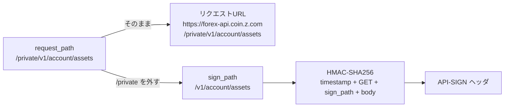

## TL;DR

- GMOコインFX の Private API では、HMAC-SHA256 の**署名対象パスとリクエストURLのパスが一致しません**。リクエストは `/private/v1/account/assets` に送りますが、署名するのは `/v1/account/assets` です
- 間違えると `ERR-5010: Signature for this request is not valid.` が返ります。しかも **HTTPステータスは 200** で返るため、ボディの `status` を見ないと失敗に気づけません
- さらに、署名が完全に正しくても **`Accept` ヘッダがないと同じ ERR-5010 が返ります**(実測・公式ドキュメント未記載)。エラーメッセージを信じて署名だけを疑うと迷宮入りします

## 背景

GMOコインFX の API を使う自動売買システム(Python)を開発しており、最初の疎通確認として参照系の Private API(資産残高の取得)を叩きました。GMO の Private API は全リクエストに HMAC-SHA256 署名(`API-SIGN` ヘッダ)が必要です。

なお、本記事の再現はすべて参照系の GET(`/private/v1/account/assets`)のみで行っています。

## 問題

署名を付けてリクエストしたところ、ERR-5010 が返り続けました。

```json
HTTP/1.1 200 OK

{
  "status": 1,
  "messages": [
    {
      "message_code": "ERR-5010",
      "message_string": "Signature for this request is not valid."
    }
  ],
  "responsetime": "2026-07-09T00:59:27.158Z"
}
```

このとき署名対象にしていた文字列(`timestamp + method + path + body`)は次のとおりです。リクエストURLのパスをそのまま署名に使っていました。

```
1783558766961GET/private/v1/account/assets
```

## 原因

### 罠1: 署名対象パスには /private を含めない

GMOコインFX の仕様では、署名対象のパスは `/v1/...` から始めます。リクエストURLのパス `/private/v1/...` とは非対称です。

```
✗ 誤: 1783558766961GET/private/v1/account/assets   → ERR-5010
✓ 正: 1783558768084GET/v1/account/assets            → status: 0(成功)
```



実はこの仕様、[公式ドキュメント](https://api.coin.z.com/fxdocs/)の署名の生成の項に注意書きがあります。

> - GETリクエストの場合、リクエストボディは空文字列とすること
> - リクエストのパスは`/v1`で始まり、`/private`で始まらないこと

注意書きとしてきちんと明記されています。それでも私が踏んだのは、サンプルコードとは違う構造で自前のクライアントを組んだためです。

```python
# 公式サンプル(抜粋)
endPoint  = 'https://END_POINT_URL'   # ← 実際は https://forex-api.coin.z.com/private
path      = '/v1/PATH'

text = timestamp + method + path + json.dumps(reqBody)   # 署名に path を使い、
# ...
res = requests.get(endPoint + path, headers=headers)      # URL 組み立てにも同じ path を使う
```

サンプルでは `/private` がプレースホルダ `END_POINT_URL` の側に隠れており、`path` 変数は署名とURL組み立ての両方にそのまま使えます。丸写しなら動きますが、自前のクライアントで「エンドポイントのフルパス(`/private/v1/...`)」を1つの変数で持ち回る設計にした瞬間、署名にも `/private` 付きのパスが流れて ERR-5010 になります。

### 罠2: 署名が正しくても Accept ヘッダがないと ERR-5010

今回さらにハマったのがこちらです。署名対象パスを直しても ERR-5010 が消えず、ヘッダを1つずつ切り分けた結果がこの表です。

| ケース | 署名対象パス | 追加ヘッダ | 結果 |
|---|---|---|---|
| A | `/private/v1/...`(誤) | Content-Type + User-Agent + Accept | ERR-5010 |
| B | `/v1/...`(正) | Content-Type のみ | ERR-5010 |
| C | `/v1/...`(正) | User-Agent のみ | ERR-5010 |
| D | `/v1/...`(正) | **Accept のみ** | **成功(status: 0)** |

つまり **`Accept` ヘッダがないと、署名が正しくても「署名が不正」というエラーになります**。httpx・requests・curl はデフォルトで `Accept` を送るため通常は顕在化せず、標準ライブラリの `http.client` や `urllib` で素のリクエストを組んだときだけ踏む罠です。

[公式ドキュメント](https://api.coin.z.com/fxdocs/)の ERR-5010 の説明は「リクエストヘッダーに指定されているAPI-SIGN(Signature)に不正がある場合に返ってきます」であり、`Accept` への言及はドキュメントにありません(2026年7月時点)。そのため、このケースではエラーコードから真因にたどり着くのが難しくなります。

なお、公式サンプルは requests を使っており、その通りに実装すれば `Accept` は自動で付与されます。ドキュメントの不備というより、標準ライブラリで最小構成のクライアントを組んだ場合にだけ現れるエッジケースだと理解しています。

### エラーコードの意味(実測)

切り分けの助けになるよう、今回実測できた範囲のエラーコードの意味を整理しておきます。

| コード | 公式の説明(要約) | 実測した条件 |
|---|---|---|
| ERR-5011 | API-KEY が設定されていない | `API-KEY` ヘッダ不在 |
| ERR-5012 | API-KEY が認証エラーの場合など | キー不明・IP許可リスト外・権限不足(ここで弾かれると署名の正誤に関係なくこのコード) |
| ERR-5010 | API-SIGN に不正がある | キーは認識された上で署名検証段階の失敗(パス間違い **or `Accept` 欠落**) |

## 解決策

リクエストURL用のパスと署名用のパスを**別引数**で扱い、署名側は `/v1/` で始まることを検証して fail-fast にします。取り違えをユニットテストで検出できる形です。

```python
import hashlib
import hmac
import time


def to_sign_path(request_path: str) -> str:
    """リクエストURLパス → 署名対象パス(/private を外す)"""
    if request_path.startswith("/private"):
        return request_path[len("/private"):]
    raise ValueError(f"unexpected path: {request_path!r}")


def build_headers(method: str, sign_path: str, api_key: str, api_secret: str, body: str = "") -> dict:
    if not sign_path.startswith("/v1/"):
        raise ValueError(f"sign_path は /v1/... で始めること: {sign_path!r}")
    timestamp = str(int(time.time() * 1000))
    text = timestamp + method + sign_path + body
    sign = hmac.new(api_secret.encode(), text.encode(), hashlib.sha256).hexdigest()
    return {
        "API-KEY": api_key,
        "API-TIMESTAMP": timestamp,
        "API-SIGN": sign,
        "Accept": "*/*",  # ないと署名が正しくても ERR-5010(実測)
        "Content-Type": "application/json",
    }
```

API キー・シークレットは環境変数や Secrets Manager から渡します(コードに直書きしない)。この構成で成功レスポンスが返ります。

```json
{"status": 0, "data": { /* 残高等 */ }, "responsetime": "..."}
```

認証エラーでも HTTP 200 で返るため、クライアント側では HTTP ステータスに加えて**ボディの `status != 0` を必ず検査**してください。

## まとめ — ERR-5010 チェックリスト

GMOコインFX API で ERR-5010 が出たら、この3つを順に確認してください。

1. **署名対象パスから `/private` を外したか** — 署名は `/v1/...`、リクエストURLは `/private/v1/...` の非対称
2. **`Accept` ヘッダを送っているか** — 素の `http.client` / `urllib` はデフォルトで送らず、署名が正しくても ERR-5010 になる
3. **HTTPステータスではなくボディの `status` を見ているか** — 認証エラーでも HTTP 200 が返る

次回は、同じシステムのレートリミット制御(POST 1回/秒・GET 6回/秒をクライアント側で強制する実装)について書く予定です。
