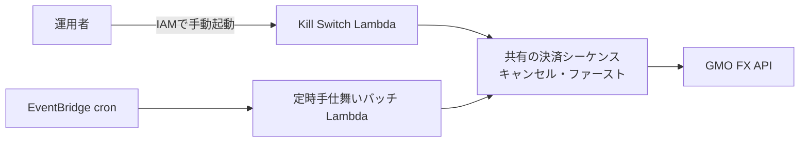
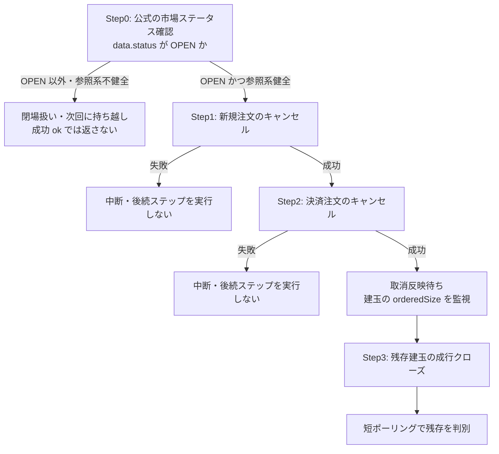

## TL;DR

- 自動売買システムの非常停止(Kill Switch)は手動起動のため、**定時バッチと同時に走り得ます**。この重なりを排他ロックではなく**冪等性で吸収する**設計にしました
- 柱は3つ。**毎回サーバから建玉・注文を再取得してから動く**(2回目の実行は自然に何もしない)、**「建玉なし」エラーを何もせず正常終了(no-op)として吸収するのは実測確認済みコードの完全一致のみ**(確認できるまで許可リストは空 = すべて失敗扱い)、**決済 POST の後は建玉一覧を短ポーリングし、消えたことだけを完了とする**
- この形に落ち着いたのは、エラーメッセージの文字列部分一致で判定していた旧実装が、**本物の決済失敗を偽成功として吸収するバグ**を起こしたためです。非常停止では「成功と誤認する」ことが最悪の失敗です

## 前提: システム概要と制約条件

GMOコインFX の API を使う自動売買システム(AWS Lambda + Python)です。全建玉の決済は2つの経路から起こります。1つは EventBridge cron で定時起動する**手仕舞いバッチ**、もう1つは緊急時に IAM 認証で手動起動する**非常停止用の Lambda**(以下 Kill Switch)です。

制約条件は次のとおりです。

- 定時バッチ同士は起動時間帯をずらしてあり重なりませんが、**Kill Switch は手動起動なので定時バッチと同時に走り得ます**。同時に走っても**二重決済を起こさない**ことが必須です
- Kill Switch は非常停止という役割上、**「確実に走って止める」ことを最優先**します。何かを待って止まる・ロック取得に失敗して動かない、という状態が許されません
- GMO はエラーを HTTP 200 + ボディの `status`/エラーコードで返すため、HTTP ステータスだけでは成否を判定できません(詳細は[レートリミット設計の記事](https://zenn.dev/ozapon/articles/gmo-fx-rate-limiter)に書きました)

## 設計の全体像

Kill Switch と定時手仕舞いバッチは、**同一の決済シーケンス関数を共有**します。冪等性はこの共有シーケンスの中で担保するため、「どちらから呼ばれたか」「同時に呼ばれたか」を意識するコードはどこにもありません。



共有シーケンスは「**キャンセル・ファースト**」と呼んでいる順序規約で、決済の前に必ず未約定注文を取り消します。決済 OCO 注文が生きたまま成行クローズすると、注文と決済が競合して建玉の状態が読めなくなるためです。



Step0 は `GET /public/v1/status` の **`data.status` が `OPEN` かどうか**で判定します(2026年8月時点の公式。値は `MAINTENANCE` / `CLOSE` / `OPEN`)。ボディ外側の `status`(API 成否の 0/1)と、`data.status`(市場状態)は**同名で別物**なので取り違えないようにしています。

以前は「参照系の Private GET が通れば取引時間内」と代理判定していました。しかし閉場中でも `openPositions` 等は HTTP 200 + ボディ `status: 0` を返すため、閉場を検知できませんでした(土曜の閉場中に実測)。そこで公式ステータスを主判定にし、参照系 GET の健全性チェックは「市場は開いているが API が壊れている」ケース用に併用しています。閉場やステータス不明のときは処理を進めず次回持ち越しとし、Kill Switch の応答も成功(`ok`)には倒しません。

この閉場判定だけを掘り下げた話(閉場中の実レスポンスと、`data.status` を使う判定)は [閉場なのに建玉取得が通った話](https://zenn.dev/ozapon/articles/gmo-fx-market-status-closed) に分けて書きました。

取消の成功も「受付」であり、反映は非同期です。Step2 の直後に成行クローズへ進むと、取消未反映のまま決済に進むことになります。状態の単純化と TP/SL とのレース回避のため、Step3 の前に各建玉の `orderedSize`(紐づく有効注文の数量)が 0 になるまで短く待ちます。測り方と、枠超過エラーを根拠にしない理由は [決済前キャンセルの設計記事](https://zenn.dev/ozapon/articles/gmo-fx-err423-ordered-size) に書いています。

## 各要素の解説

### 再取得ベースの冪等性 — サーバの状態だけを真実にする

各ステップは、実行のたびに GMO から注文一覧・建玉一覧を取得してから動きます。前回実行の結果をローカルに覚えておいて差分だけ処理する、という設計にはしていません。**判断の根拠を常にサーバ側の現在状態に置く**ことで、同じ処理が2回走っても、2回目は「注文なし・建玉ゼロ → 何もせず正常終了」に自然に収束します。

Kill Switch と定時バッチが同時に走った場合も同じです。片方が先に決済を終えていれば、もう片方は空の建玉一覧を見て何もしません。この性質はテストでも「同一条件で2回連続実行しても、2回目のクローズ対象が空であること」として固定しています。

### 取得失敗を「なし」と解釈しない — 判定不能は安全側に倒す(fail-closed)

再取得ベースの冪等性には1つ罠があります。注文一覧の**取得失敗**を「注文なし」と解釈してしまうと、キャンセルすべき注文を残したまま成行クローズに進んでしまいます。そこで各ステップの取得失敗はそのステップの失敗として扱い、**後続ステップを実行せず中断**します(上図の失敗分岐)。

### 「建玉なし」エラーの吸収は確認済みコードの完全一致のみ

シーケンス全体が例外で失敗したとき、Kill Switch 側は「建玉なし・決済済み」を示すエラーだけを何もせず正常終了(no-op)として吸収し、それ以外は失敗として通知します。この判定が本設計で最も慎重に作った部分です。

```python
# GMO が「建玉なし」「決済済み」を示す message_code(no-op 扱い・完全一致のみ)。
# 実測で確認できるまで空にしている(推測で追加しない)。空の間はすべて失敗扱い。
_NO_POSITION_ERROR_CODES: frozenset[str] = frozenset()


def _is_no_position_error(exc: BaseException) -> bool:
    if not isinstance(exc, GmoApiError):
        return False
    if not exc.message_codes:
        return False
    # すべてのコードが確認済み集合に完全一致する場合のみ no-op。
    # 未知コードが混在するなら本物の失敗の可能性があるため吸収しない
    return all(code in _NO_POSITION_ERROR_CODES for code in exc.message_codes)
```

ポイントは2つあります。1つは `all()` — 複数エラーのうち1つでも未確認コードが混ざっていたら吸収しないこと。もう1つは、**許可リストが現時点で空**であることです。

公式ドキュメントのエラーコード一覧には「ERR-254: 指定された建玉が存在しない場合に返ってきます」という記載があります(2026年8月時点)。それでも許可リストに入れていないのは、**どの呼び出しがどの状況でどのコードを返すかを実測で確認してから足す**運用にしているためです。確認できるまでは全エラーが失敗側に倒れます。非常停止が「失敗」を報告すれば人間が再試行・確認できますが、「成功」と誤報告すれば建玉が残っていることに誰も気づけません。

### 決済結果は短ポーリングで突合する

成行クローズの API 上の成功は、**約定を保証しません**。返る `status` は「受付」(`WAITING`)のことも、同期的に約定した `EXECUTED` のこともあります(実測。詳細は[決済前キャンセルの設計記事](https://zenn.dev/ozapon/articles/gmo-fx-err423-ordered-size))。いずれにせよ直後に建玉一覧を1回だけ見ても、「まだ約定待ちで残っている」のか「本当に閉じていない」のかは区別できません。

そこで決済 POST の後は建玉一覧を短くポーリングし、**数秒待っても消えない建玉だけを残存として扱います**。再取得自体に失敗した場合は「閉じたかどうか確認できない」ので、閉じた建玉としては報告しません(ここも fail-closed)。

```python
# 決済後に建玉を短ポーリングし、消えたものだけを閉じたとみなす(抜粋)
submitted_ids = [p["positionId"] for p in positions]
for attempt in range(max_attempts):
    try:
        remaining = _fetch_open_positions(client, symbol)
    except Exception:
        # 再取得失敗 → 確認不能なので閉じたと主張しない
        return {"closed": [], "residual": [], "verification_failed": True}

    remaining_ids = {p.get("positionId") for p in remaining}
    if not any(pid in remaining_ids for pid in submitted_ids):
        return {"closed": submitted_ids, "residual": [], "verification_failed": False}

    time.sleep(interval)

# ポーリング後も残る建玉は residual。閉じたと主張しない
closed = [pid for pid in submitted_ids if pid not in remaining_ids]
residual = [pid for pid in submitted_ids if pid in remaining_ids]
return {"closed": closed, "residual": residual, "verification_failed": False}
```

ポーリング後も残る建玉は「一時的な約定待ち」ではなく、手仕舞いが完了していない可能性として扱います。共有シーケンスは閉じた建玉と残った建玉を分けて返し、**残ったものを閉じたとは主張しません**。そこから先(次回起動での再取得、運用者への通知)をどう扱うかは呼び出し側の責務です。

なお Step3 の `closeOrder` 自体も、**GMO が明示的に拒否した業務エラーだけ**をゲート付きで再送します。タイムアウトや HTTP エラーは「受付済みかもしれない」ため再送せず、失敗として扱います。

## 設計判断: 代替案とトレードオフ

### 案A: 分散ロック(DynamoDB)で排他する → 不採用

定時手仕舞いバッチ自身は、EventBridge の重複配信対策として DynamoDB の条件付き書き込みによるロックを使っています。同じ仕組みを Kill Switch と共有すれば「そもそも同時に走らない」ようにできます。

不採用にしたのは、Kill Switch の役割と相性が悪いからです。ロック取得の失敗や待ちで**非常停止が走らない・遅れる**リスクは、二重実行のリスクより重い。冪等性で吸収すれば「両方走ってもよい」ので、止まる理由そのものがなくなります。ロックは「実行を1回にしたい」定時バッチの都合であって、「必ず実行したい」非常停止に持ち込む理由はありませんでした。

### 案B: エラーメッセージの文字列部分一致で「建玉なし」を判定する → 不採用(実際に踏んだバグ)

旧実装は、例外メッセージの文字列に `"4001"` のような推測した4桁コードが**部分一致**するかで「建玉なし」を判定していました。これは2つの意味で壊れていました。まず GMO の実コードは `ERR-XXXX` 形式で、推測した素の4桁とは形式が違う。さらに部分一致は、エラーメッセージに含まれる注文サイズやID の数値断片(例: `size:"14001"` が `"4001"` に一致)と偶然マッチし、**本物の決済失敗を偽成功として吸収**します。

現在の「構造化された `message_code` への完全一致・確認済みコードのみ」はこの反省からの設計で、紛らわしい数値断片で偽成功にならないことは回帰テストで固定しています。

### 案C: 未知のエラーも no-op 側に倒す → 不採用

「建玉なしっぽいエラーは広めに吸収したほうが、非常停止がエラーで終わらず運用が楽では」という考え方もあります。しかし非常停止における失敗の非対称性を考えると逆です。**誤って失敗と報告する**コストは再試行1回ですが、**誤って成功と報告する**コストは「建玉が残っているのに全員が安心する」ことです。未知のものはすべて失敗側へ、が非常停止の正解だと判断しました。

## まとめ

手動起動の非常停止にロックを置くと、「必ず走る」が壊れます。重なりは排他ではなく、サーバの現在状態だけを真実にした冪等性で吸収します。

非常停止で最悪なのは失敗そのものではなく、**成功と誤認すること**です。未知のエラーは no-op 側に倒さず、判定不能はすべて失敗として残します。閉じたことは、建玉が消えたことだけで言います。

発注する価格の作り方は[LLMに損切り価格を出させない設計](https://zenn.dev/ozapon/articles/gmo-fx-llm-sl-python)に書いています。開発中に誤発注を出さないための封じ込め設計は[テスト環境のない本番APIで誤発注を封じ込める設計](https://zenn.dev/ozapon/articles/gmo-fx-order-containment)、同じシステムのレートリミット設計は[GMOコインFX APIのレートリミットをクライアント側で強制する設計](https://zenn.dev/ozapon/articles/gmo-fx-rate-limiter)、認証まわりでハマった話は[GMOコインFX APIのERR-5010でハマった話](https://zenn.dev/ozapon/articles/gmo-fx-hmac-sign-path)、発注ボディの数量型でハマった話は[ERR-5105の記事](https://zenn.dev/ozapon/articles/gmo-fx-err5105-ifo-size)、HTTP 200 の業務エラーを空配列として握りつぶした話は[約定0件に化けた記事](https://zenn.dev/ozapon/articles/gmo-fx-http200-empty-executions)、Step2 → Step3 の取消反映待ちは[決済前キャンセルの設計記事](https://zenn.dev/ozapon/articles/gmo-fx-err423-ordered-size)、Step0 の閉場判定は[閉場なのに建玉取得が通った話](https://zenn.dev/ozapon/articles/gmo-fx-market-status-closed)に書いています。

定時手仕舞いが動かなかったこと自体を検知する監視の設計は[EventBridge Scheduler が DISABLED だと監視も沈黙する](https://zenn.dev/ozapon/articles/gmo-fx-closeout-watchdog)に書いています。
