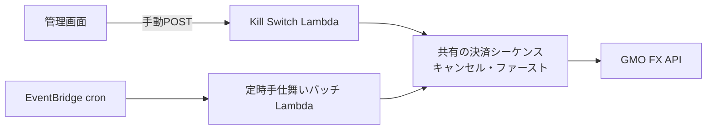
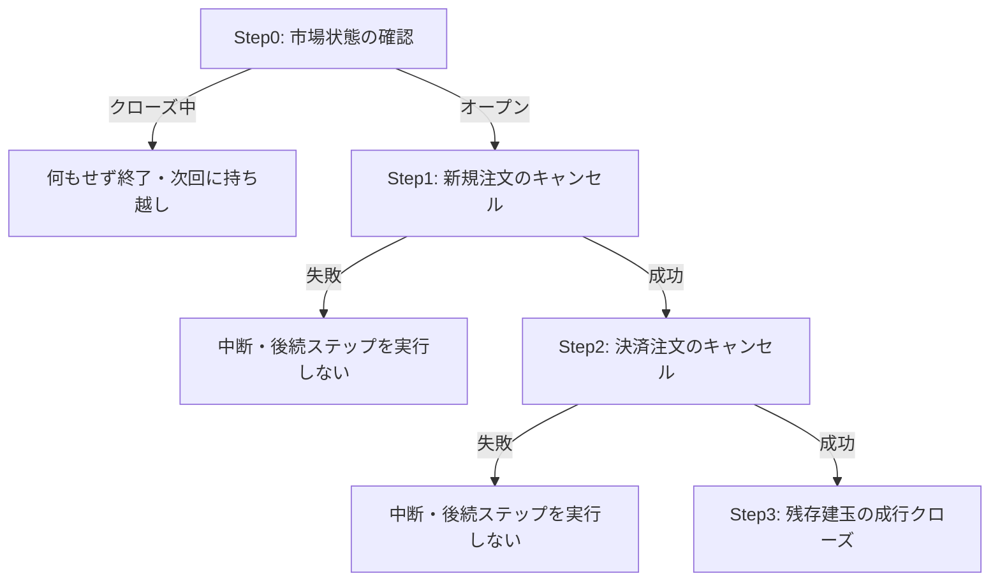

## TL;DR

- 自動売買システムの非常停止(Kill Switch)は手動起動のため、**定時バッチと同時に走り得ます**。この重なりを排他ロックではなく**冪等性で吸収する**設計にしました
- 柱は3つ。**毎回サーバから建玉・注文を再取得してから動く**(2回目の実行は自然に no-op になる)、**「建玉なし」エラーの no-op 吸収は実測確認済みコードの完全一致のみ**(確認できるまで許可リストは空 = すべて失敗扱い)、**決済結果は建玉一覧の再取得で突合する**
- この形に落ち着いたのは、エラーメッセージの文字列部分一致で判定していた旧実装が、**本物の決済失敗を偽成功として吸収するバグ**を起こしたためです。非常停止では「成功と誤認する」ことが最悪の失敗です

## 前提: システム概要と制約条件

GMOコインFX の API を使う自動売買システム(AWS Lambda + Python)です。全建玉の決済は2つの経路から起こります。1つは EventBridge cron で毎朝起動する**定時手仕舞いバッチ**、もう1つは緊急時に管理画面から手動 POST で起動する**非常停止用の Lambda**(以下 Kill Switch)です。

制約条件は次のとおりです。

- 定時バッチ同士は起動時間帯をずらしてあり重なりませんが、**Kill Switch は手動起動なので定時バッチと同時に走り得ます**。同時に走っても**二重決済を起こさない**ことが必須です
- Kill Switch は非常停止という役割上、**「確実に走って止める」ことを最優先**します。何かを待って止まる・ロック取得に失敗して動かない、という状態が許されません
- GMO はエラーを HTTP 200 + ボディの `status`/エラーコードで返すため、HTTP ステータスだけでは成否を判定できません(詳細は[レートリミット設計の記事](https://zenn.dev/ozapon/articles/gmo-fx-rate-limiter)に書きました)

## 設計の全体像

Kill Switch と定時手仕舞いバッチは、**同一の決済シーケンス関数を共有**します。冪等性はこの共有シーケンスの中で担保するため、「どちらから呼ばれたか」「同時に呼ばれたか」を意識するコードはどこにもありません。



共有シーケンスは「**キャンセル・ファースト**」と呼んでいる順序規約で、決済の前に必ず未約定注文を取り消します。決済 OCO 注文が生きたまま成行クローズすると、注文と決済が競合して建玉の状態が読めなくなるためです。



## 各要素の解説

### 再取得ベースの冪等性 — サーバの状態だけを真実にする

各ステップは、実行のたびに GMO から注文一覧・建玉一覧を取得してから動きます。前回実行の結果をローカルに覚えておいて差分だけ処理する、という設計にはしていません。**判断の根拠を常にサーバ側の現在状態に置く**ことで、同じ処理が2回走っても、2回目は「注文なし・建玉ゼロ → 何もせず正常終了」に自然に収束します。

Kill Switch と定時バッチが同時に走った場合も同じです。片方が先に決済を終えていれば、もう片方は空の建玉一覧を見て no-op になります。この性質はテストでも「同一条件で2回連続実行しても、2回目のクローズ対象が空であること」として固定しています。

### 取得失敗を「なし」と解釈しない — 段階中断の fail-closed

再取得ベースの冪等性には1つ罠があります。注文一覧の**取得失敗**を「注文なし」と解釈してしまうと、キャンセルすべき注文を残したまま成行クローズに進んでしまいます。そこで各ステップの取得失敗はそのステップの失敗として扱い、**後続ステップを実行せず中断**します(上図の失敗分岐)。

### 「建玉なし」エラーの吸収は確認済みコードの完全一致のみ

シーケンス全体が例外で失敗したとき、Kill Switch 側は「建玉なし・決済済み」を示すエラーだけを no-op(正常終了)として吸収し、それ以外は失敗として通知します。この判定が本設計で最も慎重に作った部分です。

```python
# GMO が「建玉なし」「決済済み」を示す message_code(no-op 扱い・完全一致のみ)。
# 実測で確認できるまで空にしている(推測で追加しない)。空の間はすべて失敗扱い。
_NO_POSITION_ERROR_CODES: frozenset[str] = frozenset()


def _is_no_position_error(exc: BaseException) -> bool:
    if not isinstance(exc, GmoApiError):
        return False
    if not exc.message_codes:
        return False
    # すべてのコードが確認済み集合に完全一致する場合のみ no-op。
    # 未知コードが混在するなら本物の失敗の可能性があるため吸収しない
    return all(code in _NO_POSITION_ERROR_CODES for code in exc.message_codes)
```

ポイントは2つあります。1つは `all()` — 複数エラーのうち1つでも未確認コードが混ざっていたら吸収しないこと。もう1つは、**許可リストが現時点で空**であることです。

公式ドキュメントのエラーコード一覧には「ERR-254: 指定された建玉が存在しない場合に返ってきます」という記載があります(2026年7月時点)。それでも許可リストに入れていないのは、**どの呼び出しがどの状況でどのコードを返すかを実測で確認してから足す**運用にしているためです。確認できるまでは全エラーが失敗側に倒れます。非常停止が「失敗」を報告すれば人間が再試行・確認できますが、「成功」と誤報告すれば建玉が残っていることに誰も気づけません。

### 決済結果は建玉一覧の再取得で突合する

成行クローズの後は、注文リクエストが受け付けられたことではなく、**建玉一覧を再取得して実際に消えたこと**を決済完了の根拠にします。再取得に失敗した場合は「閉じたかどうか確認できない」ので、閉じた建玉としては報告しません(ここも fail-closed)。

```python
# 決済後に建玉を再取得し、実際に閉じた positionId を確認する(抜粋・ログ等は省略)
try:
    remaining = _fetch_open_positions(client, symbol)
except Exception:
    # 再取得失敗 → クローズ結果を確認できないため「閉じた」と主張しない
    return []

remaining_ids = {p.get("positionId") for p in remaining}
closed_ids = [p["positionId"] for p in positions if p["positionId"] not in remaining_ids]
```

## 設計判断: 代替案とトレードオフ

### 案A: 分散ロック(DynamoDB)で排他する → 不採用

定時手仕舞いバッチ自身は、EventBridge の重複配信対策として DynamoDB の条件付き書き込みによるロックを使っています。同じ仕組みを Kill Switch と共有すれば「そもそも同時に走らない」ようにできます。

不採用にしたのは、Kill Switch の役割と相性が悪いからです。ロック取得の失敗や待ちで**非常停止が走らない・遅れる**リスクは、二重実行のリスクより重い。冪等性で吸収すれば「両方走ってもよい」ので、止まる理由そのものがなくなります。ロックは「実行を1回にしたい」定時バッチの都合であって、「必ず実行したい」非常停止に持ち込む理由はありませんでした。

### 案B: エラーメッセージの文字列部分一致で「建玉なし」を判定する → 不採用(実際に踏んだバグ)

旧実装は、例外メッセージの文字列に `"4001"` のような推測した4桁コードが**部分一致**するかで「建玉なし」を判定していました。これは2つの意味で壊れていました。まず GMO の実コードは `ERR-XXXX` 形式で、推測した素の4桁とは形式が違う。さらに部分一致は、エラーメッセージに含まれる注文サイズやID の数値断片(例: `size:"14001"` が `"4001"` に一致)と偶然マッチし、**本物の決済失敗を偽成功として吸収**します。

現在の「構造化された `message_code` への完全一致・確認済みコードのみ」はこの反省からの設計で、紛らわしい数値断片で偽成功にならないことは回帰テストで固定しています。

### 案C: 未知のエラーも no-op 側に倒す → 不採用

「建玉なしっぽいエラーは広めに吸収したほうが、非常停止がエラーで終わらず運用が楽では」という考え方もあります。しかし非常停止における失敗の非対称性を考えると逆です。**誤って失敗と報告する**コストは再試行1回ですが、**誤って成功と報告する**コストは「建玉が残っているのに全員が安心する」ことです。未知のものはすべて失敗側へ、が非常停止の正解だと判断しました。

## まとめ

- 手動起動の非常停止と定時バッチの重なりは、排他ロックではなく**冪等性で吸収**する。「必ず走る」が求められるコンポーネントにロックを持ち込まない
- 冪等性の基盤は**毎回のサーバ状態の再取得**。ローカルの記憶ではなくサーバの現在状態を唯一の真実にすれば、2回目の実行は自然に no-op になる
- エラーの no-op 吸収は**実測確認済みコードの完全一致のみ**。文字列部分一致は数値断片との偶然の一致で偽成功を生む。非常停止では「成功と誤認」が最悪なので、判定不能はすべて失敗側に倒す
- 決済完了の根拠は「リクエストが通ったこと」ではなく**再取得した建玉一覧から消えたこと**

同じシステムのレートリミット設計は[GMOコインFX APIのレートリミットをクライアント側で強制する設計](https://zenn.dev/ozapon/articles/gmo-fx-rate-limiter)、認証まわりでハマった話は[GMOコインFX APIのERR-5010でハマった話](https://zenn.dev/ozapon/articles/gmo-fx-hmac-sign-path)に書いています。
