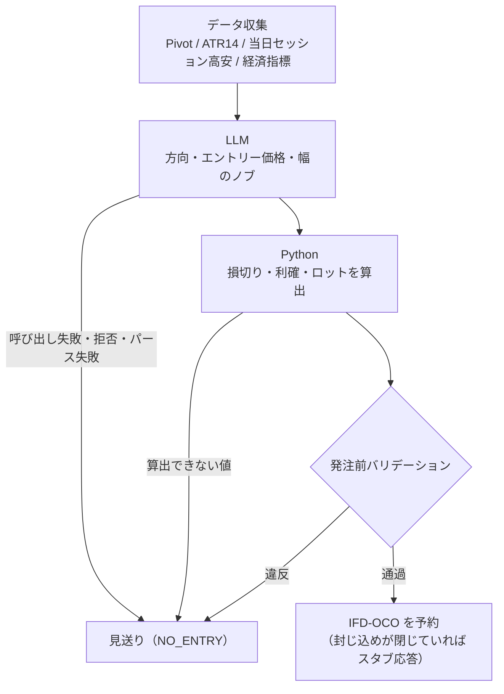

## TL;DR

- GMOコインFX の予約型自動売買(AWS Lambda + Python)で、**損切り価格・利確価格・ロットを LLM に出させず、Python が式で算出する**設計にしました
- 損切り**価格**は当初から Python です。LLM に残したのは方向・エントリー価格と、損切り幅の広さを選ぶ離散ノブ(狭い / 広い)まで。利確価格も **Structured Output のスキーマから消し**、損切り幅から組み立てます
- プロンプトで「正しいリスクリワード比(以下 R:R。損切り幅に対する利確幅の比)を出せ」と頼むのではなく、**不正な価格の組が構造的に生成されない**ようにするのが本記事の要点です。バリデーションは残していますが、それは最後の網であって主役ではありません

## 前提: システム概要と制約条件

GMOコインFX の API を使う自動売買システム(AWS Lambda + Python)です。定時の判断バッチが IFD-OCO(新規注文と、決済用の OCO をひと組で出す注文形式)を**予約**し、翌日の定時で手仕舞います。保有は日をまたぎますが 24 時間未満で、この実装では約 8 時間です。

判断は LLM の Structured Output(本実装は Anthropic の `messages.parse` + Pydantic)で `TradeDecision` という型を受け取り、以降の処理はすべてその型の上で動きます。

この構成には、設計を縛る制約がいくつかあります。

- **予約型なので、発注の時点で損切り価格と利確価格を確定しなければなりません**。IFD-OCO は「約定したらこの2本の決済注文を置く」という形なので、後から様子を見て決める余地がありません
- **判断は 1 日 1 回、Lambda の 1 起動で完結します**。人間が介入するタイミングはありません。おかしな値が出たときに気づく人はいないので、コード側で閉じておく必要があります
- **発注系 POST は two-key(独立した2つの環境変数が両方揃わないと実送信しない仕組み)で封じ込めています**。この記事では詳細を再掲しません。設計は[テスト環境のない本番APIで誤発注を封じ込める設計](https://zenn.dev/ozapon/articles/gmo-fx-order-containment)に書きました

本記事は「何を予約するか」、つまり**発注する価格をどう作るか**の設計を扱います。発注ボディの型や API のエラーには触れません。損益・成績には一切触れません。

以降、本システム固有の言い方を2つ使います。1つは **数理レール**で、Python が判断前に計算して LLM に渡す価格の基準線(Pivot と ATR)のことです。もう1つは **保有窓ボラ `ATR_h`** で、保有時間に合わせて時間スケールを揃えたボラティリティの単位です。後者は後述します。

## 設計の全体像

図に入る前に、本記事で繰り返し出る3語だけ先に決めておきます。

- **`sl_profile`**: 損切り幅の広さを選ぶ離散ノブ。`standard`(狭い) / `wide`(広い) の2値
- **`rr_target`**: 利確幅を、損切り幅の何倍に置くかの目標値
- **`ATR_h`**: 日足のボラティリティを、保有 8 時間ぶんに換算した値

データ収集から発注までの流れは次のとおりです。LLM が触れるのは1箇所だけで、価格の算術はすべてその下流にあります。



失敗側の矢印がすべて見送り(`NO_ENTRY`)へ向いているのが、この設計のもう1つの軸です。LLM 呼び出しの失敗も、拒否も、パース失敗も、算出時の例外も、バリデーション違反も、**行き先は「今日は何もしない」に統一**しています。判断バッチが落ちて記録すら残らない、という終わり方をさせません。

## 各要素の解説

### 境界: LLM は文脈、Python は価格構造

どこで線を引くかを先に決めました。LLM に任せるのは**文脈の解釈**です。当日の東京・ロンドン序盤の値動き、経済指標の並び、4時間足の形といった、言語化された材料から「どちらへ・どこで入るか」を決める部分です。

Python が持つのは**価格構造の算術**です。ボラティリティから損切り幅を出す、そこからリスクリワードを満たす利確幅を出す、呼値刻みに丸める、リスク額からロットを逆算する。ここはすべて式で書けるので、モデルに投げる理由がありません。

結果として、エントリー価格は LLM、損切り・利確価格は Python、という**非対称な分担**になりました。同じ「価格」なのに扱いが違うのは、性質が違うからです。エントリー価格は「どの水準に意味があるか」という文脈判断そのもので、Pivot やセッション高安の見立てが答えになります。一方、損切り・利確は**エントリーが決まった時点で従属的に決まる量**で、判断ではなく計算です。

### スキーマから価格を消す

分担を決めたら、次は「守らせる」のではなく「守るしかない」形にします。`TradeDecision` には `stop_loss` も `take_profit` もロットも**フィールドが存在しません**。

```python
class TradeDecision(BaseModel):
    """判断バッチの構造化出力。SL/TP は Python が算出するため含めない。"""

    sentiment_summary: str | None = None
    rationale: str
    direction: Direction                    # LONG / SHORT / NO_ENTRY
    referenced_pivot_level: PivotLevel = "NONE"
    order_type: OrderType | None = None     # LIMIT / STOP
    entry_price: float | None = None
    sl_profile: SlProfile                   # "standard" / "wide"
    rr_target: float = Field(default_factory=resolve_rr_target_default, validate_default=True)
    execution_required: bool

    @computed_field
    @property
    def atr_multiplier(self) -> float:
        """sl_profile から決定論的に導出する。算出処理はこのプロパティだけを見る。"""
        return resolve_atr_multiplier(self.sl_profile)
```

システムプロンプトにも「損切り価格・利確価格・ロット数は出力しない」と書いてありますし、Python 側が使う式もプロンプトに開示しています。モデルが自分の出す `sl_profile` や `rr_target` がどう使われるかを知らないまま選ぶのは避けたいからです。

ただし、**プロンプトに書いたことは制約ではありません**。効いているのはスキーマのほうです。仮にモデルが `stop_loss` のようなキーを足したとしても、`TradeDecision` にフィールドが無い以上、パース結果には現れず、下流のどのコードもそれを読みません。決定権をコードへ移すというのは、フィールドを消して**受け取る型から消える**ところまでやって初めて成立します。

`atr_multiplier` が `computed_field` である点も同じ発想です。LLM が出すのは離散の `sl_profile` だけで、実際に式へ入る倍率はそこから Python が引きます。下流のコードは `decision.atr_multiplier` を読むだけなので、**倍率の出どころを間違えようがありません**。

### 連続値ではなく離散ノブにする

損切り幅の倍率は、もともと LLM が**連続値**で出していました。今スキーマにあるのは `standard` / `wide` の2値だけで、実際の倍率は Python が引きます。

```python
SL_PROFILE_TO_ATR: dict[SlProfile, float] = {
    "standard": 0.7,
    "wide": 0.8,
}


def compute_recommended_sl_profile(atr_14d: float) -> RecommendedSlProfile:
    """判断時点の ATR14 から Python 側の推奨プロファイルを決める(user prompt に注入する)。"""
    if atr_14d >= ATR14_WIDE_THRESHOLD:
        return "WIDE"
    return "STANDARD"
```

ここで残したのは**幅の「意味」**です。「今日は当日レンジが広いので損切り幅を広く取るべき局面か」という判断は文脈側にあります。潰したのは**数値の自由度**です。0.72 と 0.74 の差を LLM に選ばせても、その差を説明できる根拠はありません。

さらに、Python 側で ATR14 から推奨プロファイルを計算し、ユーザープロンプトに「推奨 sl_profile: STANDARD」の形で注入しています。プロンプトでは、推奨と文脈が整合するときは推奨に従い、明確に反する根拠があるときだけ逆を選ぶよう指示しています。判断の余地は残しつつ、既定は決定論側に置いた形です。倍率 0.7 / 0.8 と推奨の閾値は外部仕様ではなく実装上の定数で、このマップは固定値として扱っています。

### ATR_h: 保有窓に時間スケールを合わせる

損切り幅の単位に日足 ATR をそのまま使うと、単位が合いません。保有するのは約 8 時間なのに、幅の基準が「1 日ぶんの値動き」になってしまうためです。

そこで、保有窓ぶんのボラティリティに換算した `ATR_h` を単位にしています。

```python
def calculate_atr_h(atr: float, hold_hours: float | None = None) -> float:
    """保有窓ボラ ATR_h = ATR14 × √(HOLD_HOURS/24) を算出する。"""
    _require_positive_atr(atr)
    hh = resolve_hold_hours(hold_hours)
    return atr * math.sqrt(hh / 24.0)
```

`√(T/24)` はボラティリティの時間スケーリングの標準的な仮定で、保有時間が短くなればその平方根の比率で幅も縮む、という換算です。保有 8 時間なら `√(8/24) ≒ 0.58` なので、**日足のおよそ 6 割**が幅の単位になります。

`HOLD_HOURS` は環境変数で、既定は 8 です。手仕舞い時刻を変えるなら、この 1 つの値を動かせば損切り幅もロットも整合したまま追随します。

損切り価格はこの単位で決まります。

```python
mult = _clamp(atr_multiplier, ATR_MULT_MIN, ATR_MULT_MAX)   # 0.6〜1.0
atr_h = calculate_atr_h(atr, hold_hours)
stop_raw = entry_price - atr_h * mult if side == "LONG" else entry_price + atr_h * mult
```

倍率のクランプ範囲は 0.6〜1.0 ですが、LLM 経路から入ってくるのは `sl_profile` がマップした 0.7 / 0.8 だけです。クランプは、テストやシミュレーションから直接呼ばれたときのための防御として置いてあります。

### 利確は検査せず、組み立てで担保する

利確価格は、**確定済みの損切り幅から作ります**。

```python
def calculate_take_profit(entry_price, stop_loss, rr_target, side) -> float:
    """TP = entry ± rr_target × |entry − stop_loss|。R:R を組み立ての段階で担保する。"""
    rr = _clamp(rr_target, RR_TARGET_MIN, RR_TARGET_MAX)   # 1.0〜1.5
    risk = abs(entry_price - stop_loss)
    tp_raw = entry_price + rr * risk if side == "LONG" else entry_price - rr * risk
    ...
```

これが本記事でいちばん言いたい形です。**R:R をチェックするのではなく、R:R を満たす価格しか作れないようにする**。LLM が出した `rr_target` は「どのくらいの比率を狙うか」というノブで、価格そのものではありません。比率から距離を作るのは Python の仕事です。

`rr_target` は 1.0〜1.5 にクランプします。範囲外の値が来ても**拒否はしません**。ここで見送りに倒すと、比率の指定ミス1つでその日の判断が丸ごと消えてしまいます。範囲に収めれば、それ以上の悪さはしない値です。

### 丸めは、向きと順序を固定する

発注価格は呼値刻みに乗せる必要があります。刻みは銘柄ごとに Public API の `GET /public/v1/symbols` が返す `tickSize` で確認します(本実装の確認は 2026年6月時点)。生の計算値はそのまま出せないので丸めが要りますが、ここで決めることが2つあります。**どちら側に丸めるか**(向き)と、**どの順に丸めるか**(順序)です。

まず向きです。損切り・利確はどちらも、**entry から遠ざける側**に丸めます。

```python
def _round_away_from_entry(price: Decimal, side: Side, *, is_stop: bool) -> Decimal:
    """呼値刻みへ「entry から遠ざける向き」に丸める。

    SL は LONG 切り下げ / SHORT 切り上げ、TP は LONG 切り上げ / SHORT 切り下げ。
    """
    if is_stop:
        rounding = ROUND_DOWN if side == "LONG" else ROUND_UP
    else:
        rounding = ROUND_UP if side == "LONG" else ROUND_DOWN
    return price.quantize(TICK_SIZE, rounding=rounding)
```

利確側だけを見て「切り捨てのほうが保守的だろう」と考えると逆になります。利確を entry 寄りに丸めると利確幅が縮み、`rr_target` が 1.0 のときに丸め誤差で R:R が 1.0 を割ります。

エントリー価格も丸めますが、こちらは**基準にする点が違います**。損切り・利確は「entry から遠ざける」向き、エントリー価格は「**現値から遠ざける**」向き(LONG は切り下げ、SHORT は切り上げ)です。押し目・戻りを待つ注文なので、丸めで現値へ寄せると、意図より約定しやすい水準になってしまいます。

次に順序です。丸めと算出は「entry → 損切り → 利確 → ロット」で固定しています。

```python
# tick 丸めを先に行い、丸め済み entry から SL → TP を決定論算出する
entry_price = _round_tick_entry(decision.entry_price, decision.direction)
stop_loss = calculate_stop_loss(entry_price=entry_price, atr=atr,
                                atr_multiplier=decision.atr_multiplier, side=decision.direction)
take_profit = calculate_take_profit(entry_price=entry_price, stop_loss=stop_loss,
                                    rr_target=decision.rr_target, side=decision.direction)
```

この順序が、向きの効果を守ります。損切りを先に丸めて確定させ、**丸め済みの損切り幅から利確を計算する**ので、丸めで損切り幅が広がっても、利確はその広がったぶんに対して `rr_target` 倍の距離を取ります。そのうえで利確自身も遠ざける向きに丸めるため、実際の R:R は組み立て上つねに `rr_target` 以上になります。

ロット計算も同じ順序に乗っています。ロットは損切りまでの距離から逆算するので、**その距離が実際に発注する価格と一致していないと、意図したリスク量になりません**。丸める前の値でサイジングし、丸めた値で発注する、という食い違いを順序で潰しています。

### 例外も見送りに畳む

損切り・利確の算出は、ATR が非正や非有限のときに `ValueError` を送出します。判断バッチ側はこれを捕捉して、その日の判断を `no_entry` に畳みます。

```python
try:
    stop_loss = calculate_stop_loss(...)
    take_profit = calculate_take_profit(...)
except ValueError as exc:
    # 1 件の異常値で Lambda 全体を落とし、監査ログの保存まで飛ばさない
    s3_logger.save_decision_log({**log_base, "status": "no_entry",
                                 "reason": "sl_tp_calculation_failed", "detail": str(exc)}, today=today)
    return {**log_base, "status": "no_entry", "reason": "sl_tp_calculation_failed"}
```

LLM 呼び出し側も同じ方針です。通信・認証・SDK の例外も、`stop_reason` が `refusal` の場合も、パースできなかった場合も、すべて `no_entry()` が返す安全側の `TradeDecision` に倒します。

```python
def no_entry(rationale: str) -> TradeDecision:
    """発注を見送る安全側の TradeDecision を生成する(refusal / パース失敗 / 休場 等)。"""
    return TradeDecision(
        direction="NO_ENTRY",
        execution_required=False,
        referenced_pivot_level="NONE",
        rationale=rationale,
        sl_profile="standard",
        rr_target=resolve_rr_target_default(),
    )
```

見送りであっても `TradeDecision` 型で返すので、下流に「決定が無い」という状態が流れません。呼び出し側は分岐を1本(`should_enter`)持つだけで済みます。

なお、Anthropic SDK のリクエストタイムアウトは既定より短く明示しています。Lambda のタイムアウトが先に来ると、上の `except` に入る前に落ちて**見送ったという記録すら残らない**からです。

### バリデーションは最後の網として残す

利確を組み立てで作るようになった今、R:R 下限のチェックは**実装の既定では**常に通過します(下限の既定は 1.0、`rr_target` の下限も 1.0 のため)。下限だけを環境変数で引き上げれば通らなくなるので、「組み立てで守れているから不要」とは言えません。そのうえで、発注前バリデーションは今も残してあります。

```python
class ValidationReasonCode(StrEnum):
    # 違反理由コード（抜粋）
    PRICE_ORDER_VIOLATION = "PRICE_ORDER_VIOLATION"                # LONG なら SL < Entry < TP
    RR_RATIO_BELOW_MINIMUM = "RR_RATIO_BELOW_MINIMUM"              # R:R が下限を割る
    MAX_ENTRY_DISTANCE_VIOLATION = "MAX_ENTRY_DISTANCE_VIOLATION"  # entry が現値から遠すぎる
```

残す理由は2つあります。1つは、丸め誤差や将来の式変更で組み立て側の保証が崩れたときに気づけること。もう1つは、**そもそも組み立てでは守れない条件があること**です。

後者が本命です。エントリー価格は LLM が出すので、現値から離れすぎた水準を指してくる可能性が残ります。ここは `|entry − 現値| ≤ 係数 × ATR14`(係数の既定は 0.3)で上限を切っています。約定しない予約を毎晩置き続けても意味がないので、**距離そのものを機械的に拒否**します。システムプロンプト側でも現値近傍の押し目・戻りを狙う LIMIT を第一候補にするよう指示していて、このバリデーションと対になっています。

なお、この乖離上限は ATR14 を材料にするので、バリデーション関数の `atr` 引数には既定値を持たせていません。渡し忘れたときに、このチェックだけが静かに無効化されるより、`TypeError` で落ちるほうが気づけるからです。

## 設計判断: 代替案とトレードオフ

ここが本記事の本題です。採用しなかった案を、効果の優劣ではなく**失敗の仕方**で並べます。

### 案A: 利確価格を LLM に出させる → 不採用(最初の形)

最初の形はこれでした。ただし、損切り価格を LLM に出させていた時期は一度もありません。**損切りは最初から Python** が算出していて、LLM のスキーマにあったのは `take_profit`(利確**価格**)と、連続値の倍率です。プロンプトでは「R:R は下限以上にすること」と指示していました。

壊れたのは、両方の価格を LLM が出したからではなく、**時間軸が噛み合っていなかった**からです。当時の損切りは日足 ATR に倍率(1.5〜2.0)を掛けた幅で、これは 8 時間の保有窓に対して過大でした。その広い損切り幅に対して R:R 下限を満たす利確を置こうとすると、**保有窓の中で到達し得ない距離**になります。逆に保有窓で届く距離に利確を置けば R:R 下限を割ります。

つまり、分母(Python が日足尺度で決めた損切り幅)と分子(LLM がセッション尺度で置く利確幅)の単位が違いました。どちらに倒しても発注前バリデーションで棄却される、という構造です。

重要なのは、**これがプロンプトの書き方の問題ではない**ことです。単位が違う以上、指示を強めても解は増えません。むしろモデルが指示に忠実であるほど「今日は条件を満たせないので見送り」に収束します。

そこで手を入れたのは2箇所でした。利確をスキーマから消して損切り幅から組み立てる形に変え(本記事の主題)、あわせて損切りの単位そのものを保有窓に合わせました(後述の案F)。案A は**利確を誰が出すか**の話、案F は**損切りの単位をどう取るか**の話で、両方を直さないとスケールの不一致は解けません。

### 案B: 利確価格を出させたまま、バリデーションで棄却する → 不採用

案A の状態のまま、「単位が合わずに生まれる不正な組はバリデーションで落とせばよい」と考えることもできます。安全側ではあります。

ただしこれは、**棄却が常態になる**ということです。データを集め、LLM を呼び、判断を得ても、最後の関門でほぼ落ちるなら、パイプライン全体の出力がほぼ見送りになります。安全性の問題ではなく、システムとして機能していない状態です。バリデーションは「稀に来る異常を止める網」であって、「毎回の出力を捨てる装置」ではありません。

### 案C: プロンプトの制約だけ強化する(スキーマには残す) → 不採用

「価格を出すな」とプロンプトに書き、フィールドは残しておく案です。実際、今のシステムプロンプトにも同じ趣旨の文は書いてあります。

これを最終防壁にしなかったのは、**プロンプトはコードではない**からです。フィールドがあれば値は入り得るし、入った値を下流が読んでしまう可能性も残ります。決定権をコード側に移すと決めたなら、フィールド自体を消すのが筋でした。プロンプトの記述は、モデルに式を開示して `sl_profile` / `rr_target` を意図どおり選ばせるための説明として残しています。

### 案D: 倍率を連続値で出させ続ける → 不採用

損切り幅の倍率は、実際に長らく LLM が連続値で出していました(単位の変更前は 1.5〜2.0、変更後は 0.6〜1.0)。クランプはかかるので、危険な値にはなりません。単位を ATR_h に直した時点で、このまま続ける選択肢もありました。

採用しなかったのは、**実質的に連続な自由度をモデルに与えることになる**からです。0.72 と 0.78 のどちらが妥当かを説明できる材料はプロンプトの中にありませんし、その差を検証する手段もありません。今は 0.7 / 0.8 の2点に閉じ、推奨は Python が ATR14 から計算してプロンプトに注入しています。自由度は「局面の解釈」の側にだけ残しました。

### 案E: 方向もエントリーも Python のルールだけで決める → 不採用

価格をコード側に寄せていくと、「全部ルールで書けばよいのでは」という方向に行き着きます。実際、損切り・利確・ロットはそうしました。

そこで止めた理由は、**それをやると LLM を使う理由が無くなる**からです。残したのは、当日のセッションの値動き・経済指標の並び・4時間足の形といった、ルール化しにくい材料の解釈です。逆に言えば、算術で書ける部分を LLM に残す理由はありません。境界はここで切りました。

### 案F: 日足 ATR をそのまま損切り幅の単位に使い続ける → 不採用

案A で起きたスケール不一致の、損切り側の当事者がこれです。日足 ATR は「1 日ぶんの値動きの目安」であって、8 時間保有の設計にそのまま持ち込むと単位が合いません。利確を組み立てに変えても、損切りの単位が日足のままなら、狙う利確幅も日足尺度で膨らむだけです。

`√(HOLD_HOURS/24)` を挟むことで、損切り幅・利確幅・ロットのすべてが**保有窓と同じ時間軸**に乗ります。保有時間を変えたときに一箇所で追随できるのも、この形にした副次的な利点です。

## まとめ

- LLM と Python の境界は「**文脈の解釈 / 価格構造の算術**」で引きました。同じ価格でも、エントリーは文脈判断、損切り・利確はエントリーからの従属計算なので、扱いを非対称にしています
- **プロンプトの禁止は制約ではありません**。決定権をコードへ移すなら、Structured Output のスキーマからフィールドを消すところまでやります
- 連続値を渡す前に「その自由度を説明できるか」を問いました。説明できないなら**離散ノブ**にして、既定は Python が計算して注入します
- R:R は検査ではなく **組み立てで担保**します。利確を損切り幅から作れば、不正な組はそもそも生成されません。丸めは entry から遠ざける向きに倒し、順序を entry → SL → TP → サイジングで固定して、発注価格とロット計算の前提を一致させます
- それでもバリデーションは残します。組み立てで守れるのは価格どうしの関係だけで、**LLM が出したエントリー価格が現値から離れすぎている**ような条件は、最後の網でしか止められません
- 失敗の行き先はすべて見送りに統一します。例外・拒否・パース失敗・バリデーション違反のどれであっても、記録を残して「今日は何もしない」に倒します

本記事は、この自動売買システムの記事群のうち「**何を予約するか**」を扱う上流にあたります。予約したあとの話は、開発中の誤発注を封じ込める仕組みを[テスト環境のない本番APIで誤発注を封じ込める設計](https://zenn.dev/ozapon/articles/gmo-fx-order-containment)に、`ifoOrder` の発注ボディで数量の型に踏んだ話を[GMOコインFX APIのERR-5105でハマった話](https://zenn.dev/ozapon/articles/gmo-fx-err5105-ifo-size)に、API 呼び出しの流量制御を[GMOコインFX APIのレートリミットをクライアント側で強制する設計](https://zenn.dev/ozapon/articles/gmo-fx-rate-limiter)に、建てたポジションを緊急停止で確実に閉じる設計を[GMOコインFX 自動売買の非常停止(Kill Switch)](https://zenn.dev/ozapon/articles/gmo-fx-kill-switch-idempotency)に、それぞれ書いています。
