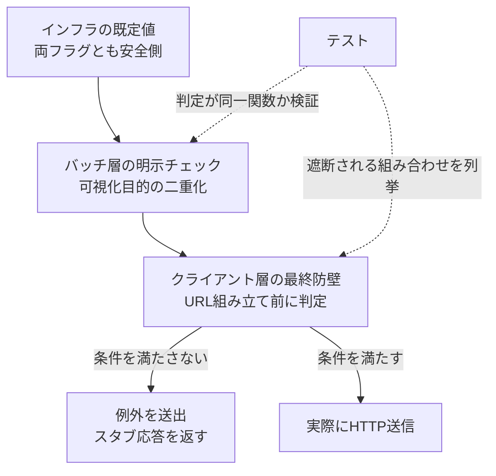

## TL;DR

- GMOコインFX API には、注文を試しに投げられるサンドボックスやテスト環境が提供されていません(2026年7月時点、公式ドキュメント全文で確認)。開発中の誤発注はそのまま本番の口座に届きます
- 対策として、独立した2つの環境変数が**両方**揃わない限り発注系 POST を送らせない仕組み(two-key interlock)を作りました。既定値はどちらも安全側です
- 封じ込めは複数の層で重ねていますが、**判定ロジックそのものは1箇所に集約**しています。過去にこの判定を3箇所へコピーしたところ、非常停止の機能だけが解禁側の判定になってしまい、実際に落ちました。層は重ねてよくても、判定は一本化すべきというのがこの事故から得た教訓です

## 前提: システム概要と制約条件

GMOコインFX の API を使う自動売買システム(AWS Lambda + Python)です。発注・取消・決済を行う POST エンドポイントは本番の口座に直接作用し、試し撃ちができる環境は用意されていません。

開発は段階を分けて進めています。まず発注 API 呼び出しを完全にスタブ化した状態で1〜2週間の連続稼働を確認し、そのあとに最小ロットでの実発注へ進む、という順序です。

本記事は**このうち前段階、実発注に進む前の「封じ込め」の設計だけ**を扱います。実発注に進んだ結果や、そこで得た知見は本記事の範囲外です。

制約条件は次のとおりです。

- 発注系 POST(新規注文・注文取消・建玉決済)は、一度サーバに届くと取り消せない副作用を持つ
- 開発中はコードが変わり続けるため、**設定ミス1つで実送信されてしまう**構成は避けたい
- 緊急停止のような「常に確実に動いてほしい」機能も、この封じ込めの対象から外すわけにはいかない

## 設計の全体像

発注系 POST に対して、4つの層でガードを重ねています。



層は重ねていますが、**「解禁してよいか」を判定するロジックは1つの関数に集約**しています。この1点が、後述する事故の核心です。

## 各要素の解説

### 独立した2つの鍵

発注を解禁する条件は、2つの環境変数が両方とも真であることです。

```python
_LIVE_ORDER_FLAG = "ALLOW_LIVE_ORDERS"  # 発注解禁の主フラグ
_PHASE_FLAG = "TRADING_PHASE"           # 実行フェーズ(既定はモック段階)
_LIVE_PHASES = frozenset({"実取引", "検証"})

def live_orders_allowed() -> bool:
    allow = os.environ.get(_LIVE_ORDER_FLAG, "").strip().lower() == "true"
    phase = os.environ.get(_PHASE_FLAG, "モック").strip()
    return allow and phase in _LIVE_PHASES
```

片方だけ設定を誤っても解禁されません。既定値はどちらも安全側(未設定なら遮断)です。

もう1点、ロットを最小単位に固定する別目的のフラグがあるのですが、これは封じ込めの判定には**混ぜていません**。「実送信するかどうか」と「送信する量をどれだけ絞るか」は別の責務だからです。

### 遮断は URL 組み立ての手前に置く

判定は、HTTP クライアントがリクエストを組み立てるより前で行います。

```python
class OrderBlockedError(RuntimeError):
    """発注解禁の条件を満たさない状態で発注系 POST を送信しようとした場合に送出する。"""

def private_post(self, path: str, body=None):
    if path in _ORDER_PATHS and not live_orders_allowed():
        logger.warning(
            "order_blocked",
            path=path,
            reason="解禁条件を満たさないため発注系 POST を遮断",
        )
        raise OrderBlockedError(f"発注系 POST は封じ込め中のため実送信できません: {path}")
    # ここより先で初めて URL を組み立てて送信する
    ...
```

判定に使う材料は「呼び出そうとしているパスが発注系の集合に含まれるか」だけです。リクエストボディの形式をどう変えても、この判定は迂回できません。実際、リクエストボディの表現を辞書からオブジェクトに変えた際に判定が迂回されていないかを確認する回帰テストも用意しています。

### 層は重ねる、しかし判定は一本化する

発注系 POST を送る直前のバッチ処理にも、同じ判定を明示的に置いています。クライアント層でも同じ判定が効くので機能としては重複していますが、テストやレビューの際に安全条件がその場で見えることに意味があります。

```python
if not live_orders_allowed():
    result = {"stubbed": True, "reason": "live_orders_disabled"}
    logger.info("order_stubbed", extra={"reason": "two_key_interlock"})
else:
    result = _place_order(...)
```

ここで重要なのは、バッチ層も非常停止機能も、**判定ロジックを独自に書き直さず、同じ関数を呼んでいる**ことです。層を重ねることと、判定のロジックを複製することは別物です。この区別を曖昧にした結果、次に述べる事故が起きました。

### 封じ込めを制御下で一時解除する

発注 API の未確定な仕様(必須パラメータの名称など)を確認する必要があり、封じ込めを一時的に解除して本番の発注エンドポイントを叩いたことがあります。そのときの手順です。

- 解除はプロセス内の環境変数だけで行い、ディスク上の設定ファイルは変更しない
- 空のボディなど、あえて不正なリクエストを送って業務エラーを誘発する。GMO は必須パラメータが欠けていると、エラーメッセージにその項目名を列挙して返すため、注文を成立させずに必須フィールドの構成を確認できる
- 作業後は、注文一覧・建玉一覧の両方が空であることを確認してから記録に残す

これにより、実際に発注することなく仕様の一部を確定できました。一方で、注文が成立したときにしか得られない情報(成功時のレスポンス形式など)は、意図的に未確定のまま残しています。

## 設計判断: 代替案とトレードオフ

### 案A: 単一のフラグで足りるのでは → 不採用

フラグが1つだと、それを立て忘れる、あるいは別の目的で立てたままにする、という単純な設定ミスがそのまま実送信に直結します。独立した2つの条件を要求することで、片方の設定ミスは残りの1つが吸収します。

### 案B: 判定ロジックを呼び出し側ごとに書く → 不採用(実際に踏んだ事故)

最初は、バッチ層と非常停止機能がそれぞれ独自に判定ロジックを持っていました。ここで事故が起きています。

インフラ側が実際に供給する値は小文字の `"true"` でしたが、ある箇所の判定は大文字の `"True"` との厳密一致で書かれていて、常に不一致(遮断)と判定していました。一方、別の箇所(非常停止機能)は大文字小文字を無視する緩い判定になっていました。

結果として、**発注そのものは遮断されたまま、非常停止機能だけが「解禁されている」と判定してしまう**という食い違いが起きました。緊急停止という最も確実に動いてほしい機能が、この不一致によって異常終了する形で発覚しています。

修正は、判定を1つの関数に集約し、全呼び出し箇所がその**同一の関数オブジェクトを参照している**ことをテストで固定する、というものでした。

```python
def test_gate_is_single_sourced() -> None:
    """全ての呼び出し箇所が同一の関数オブジェクトを参照している(判定の再分裂を防ぐ)。"""
    assert batch_module.live_orders_allowed is client_module.live_orders_allowed
    assert kill_switch_module.live_orders_allowed is client_module.live_orders_allowed
```

値の一致ではなく `is` によるオブジェクト同一性を見ているのがポイントです。誰かが再び独自の判定を書いてしまったら、値が偶然一致していてもこのテストは失敗します。

この事故から得た教訓は、**安全機構を多重化することと、判定ロジックを複製することは別物**だということです。層を重ねるのは冗長性ですが、判定を複製するのは脆弱性になり得ます。

### 案C: 実際に発注して仕様を確認する → 不採用

未確定な仕様を確認する最も直接的な方法は、実際に発注して結果を見ることです。今回はこの方法を採らず、無効なボディでエラーを誘発する方法を選びました。

代償として、成功時のレスポンス形式など、実際に注文が通らないと分からない情報は未確定のまま残っています。これは開発判断として明示的に記録し、実発注の段階で確認する項目として残しました。

### 案D: ロット制限フラグを封じ込めにも使う → 不採用

最小ロットに固定するフラグは、既に別の目的で存在していました。これを封じ込めの条件にも使えば、管理する変数を減らせます。

採用しなかったのは、両者の責務が異なるためです。ロット制限は「実送信された場合の被害を小さくする」ためのもので、封じ込めは「そもそも実送信させない」ためのものです。ロット制限の設定を変える作業のついでに、意図せず封じ込めが緩んでしまう事態を避けたいと考えました。

## まとめ

- 本番にしかない副作用の大きい API に対しては、**解禁条件を既定で安全側**にし、独立した複数の条件を要求する
- 遮断はできるだけ手前の層に置き、**判定に使う材料を最小限**にする。ボディの形式が変わっても揺るがない判定になる
- 安全機構は層で重ねてよいが、**判定ロジックは1箇所に集約**する。複製すると、食い違いが起きたときにどちらが正しいか分からなくなる
- 安全機構そのものもテスト対象にする。特に「正しく遮断されるか」だけでなく、**「正しく解禁されるか」も含めて検証する**。遮断側だけを固く作ると、解禁が必要な場面(今回で言えば非常停止)で機能しない事態を見逃す

同じシステムの非常停止の設計は[GMOコインFX 自動売買の非常停止(Kill Switch)](https://zenn.dev/ozapon/articles/gmo-fx-kill-switch-idempotency)に、レートリミットの設計は[GMOコインFX APIのレートリミットをクライアント側で強制する設計](https://zenn.dev/ozapon/articles/gmo-fx-rate-limiter)に書いています。
