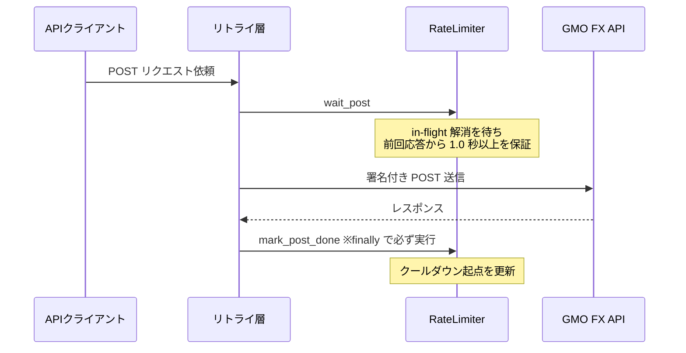

## TL;DR

- GMOコインFX の Private API には呼び出し上限(POST 1回/秒・GET 6回/秒)があります。これをサーバに弾かれてから対処するのではなく、**クライアント側で送信前に強制する** RateLimiter を設計しました
- ポイントは3つ。**クールダウンの起点を「送信時刻」ではなく「応答受信後」に置く**、**in-flight の POST がある間は後続を通さない**、**タイムアウト時にもクールダウンを進める**
- プロセス内のリミッターで済ませられるのは、**発注・決済の Private POST を持つ定時バッチ同士が、時間差の cron で重ならないアーキテクチャ**とセットの判断です。プロセスを跨いで Private POST が重なり得る例外(非常停止)は、レートリミットではなく冪等設計で安全側に倒します

## 前提: システム概要と制約条件

GMOコインFX の API を使う自動売買システム(AWS Lambda + Python)です。本記事が対象にするのは、**発注・取消・決済の Private POST** を出すコンポーネントです。具体的には、起動時間帯が重ならないように組んだ定時バッチ(EventBridge cron 起動)と、緊急時に手動で全建玉を成行決済する**非常停止用の Lambda** です。

制約条件は次のとおりです。

- GMO Private API の呼び出し上限は **POST 1回/秒・GET 6回/秒**(2026年8月時点の[公式ドキュメント](https://api.coin.z.com/fxdocs/)記載)。なお公式ドキュメントには「制限はシステム負荷状況によって一時的に変更する場合があります」とあり、上限ぴったりを狙わず余裕を持って守る前提です
- 発注・取消系の POST は失敗時のコストが高い。安易な再送は**二重注文**のリスクになる
- 401 検知時にタイムスタンプ再取得+再署名で1回だけリトライする設計があり、**リトライ経路でもレートリミットを守る**必要がある

## 設計の全体像

RateLimiter は「送信前に枠を取る」「応答受信後に枠を返す」の2フェーズで使います。



`wait_post()` は 401 リトライの**各試行前**に呼ばれるフック(`pre_attempt_hook`)として渡してあり、初回もリトライも同じ制御を通ります。さらに POST の 401 リトライでは、フックとは別に再送前へ固定で1秒の待機を挟んでいます。

## 各要素の解説

### なぜ wait / mark の2フェーズに分けたか

「呼び出し間に `sleep(1)` を入れる」だけなら関数は1つで済みます。分けたのは、**クールダウンの起点を応答受信後に置いた**ためです。送信前(`wait_post`)と応答受信後(`mark_post_done`)は別のタイミングなので、API も2つに分かれます。

```python
def mark_post_done(self) -> None:
    """POST 応答受信後に呼ぶ。クールダウン起点を更新し、後続の wait_post() を解放する。"""
    with self._post_cond:
        self._next_post_allowed = time.monotonic() + self.POST_INTERVAL
        self._post_in_flight = False
        self._post_cond.notify_all()
```

時刻には `time.time()` ではなく `time.monotonic()` を使っています。NTP 同期などで壁時計が飛んでも、間隔の計測が壊れないようにするためです。

### in-flight 直列化 — 「1秒空ける」だけでは足りない

単純な最終送信時刻の記録だと、並列スレッドが同時に `wait_post()` を通過し、POST が重なって飛ぶ余地が残ります。そこで `threading.Condition` で「応答待ち中の POST があるか」を管理し、ある間は後続をブロックします。

```python
def wait_post(self) -> None:
    while True:
        with self._post_cond:
            while self._post_in_flight:      # 応答待ち中の POST がある間は待機
                self._post_cond.wait()
            now = time.monotonic()
            remaining = self._next_post_allowed - now
            if remaining <= 0:
                self._post_in_flight = True  # 枠を確保して返る
                return
        time.sleep(remaining)  # sleep はロック外で(デッドロック回避)
        # ループして再チェック(sleep 中に別スレッドが割り込む可能性があるため)
```

`sleep` をロックの外で行うのは、ロックを持ったまま眠ると `mark_post_done()` 側が永久にロックを取れなくなるためです。sleep 明けに枠を取り直すループ構造は、条件変数を使う並行処理の定石パターンです。

### タイムアウトでもクールダウンを進める

呼び出し側(リトライユーティリティ)では、`mark_post_done()` を `finally` で必ず呼びます。

```python
try:
    resp = client.request(m, url, headers=headers, content=body)
    return resp
finally:
    # 例外(タイムアウト・接続断)でも POST タイマーを進め、即時再送を防ぐ
    if m == "POST" and post_attempt_hook is not None:
        post_attempt_hook()  # mark_post_done
```

タイムアウトは「サーバが処理しなかった」ことを意味しません。注文が実は通っているかもしれない状態で即再送すると、レート超過と二重注文の両方を踏み得ます。例外時こそクールダウンを進めるのが安全側です。

### GET は軽量版で十分

GET(残高照会・建玉一覧など)は失敗してもリトライすればよく、in-flight 直列化までは不要です。`Lock` + 最小間隔(≥167ms)のシンプルな実装にし、POST とはカウンタを独立させています。Public エンドポイント(価格取得・市場ステータス等)の GET にも同じ間隔を適用しています。

なお本記事で「重なり」を論じるのは Private POST についてです。GET は上限も失敗時のコストも別物なので、プロセスを跨いだ保証は本設計の対象外としています。

### テストは時刻をモックして決定的に

`time.monotonic` と `time.sleep` を `unittest.mock.patch` で差し替え、「応答受信が 0.3 秒時点なら、0.8 秒時点の次リクエストは 0.5 秒 sleep する」という検証を実時間なしで行っています。実スレッドを使うのは in-flight ブロッキングの検証のみです。

## 設計判断: 代替案とトレードオフ

### 案A: サーバに弾かれてからバックオフ(リアクティブ) → 不採用

一般的な Web API なら 429 + Retry-After を見て待つ設計も定石です。不採用にした理由は2つ。発注系 POST は「一度サーバに届いてしまったか」の判別が難しく、エラーからの再送判断が複雑になること。もう1つは、GMO はエラーを HTTP 200 + ボディの `status`/エラーコードで返す仕様のため、HTTP ステータス頼みのバックオフ機構がそのまま使えないことです。

### 案B: トークンバケット → 不採用

トークンバケットの本質は「平均レートを守りつつバーストを許す」ことです。しかし GMO の上限がどの時間窓で計測されるか外部からは分からないため、バーストを許す設計は「こちらの解釈では合法、サーバの解釈では超過」になり得ます。固定間隔(1回/秒)なら計測窓の解釈に依存しません。バッチあたりの呼び出しは数回なので、スループットの犠牲は実質ゼロです。

### 案C: 送信時刻を起点にする → 不採用

「前回の送信から1秒」で測ると、前回の応答が遅れた場合に、サーバから見た処理間隔が1秒を切る可能性があります。サーバがどの時点をカウントするか不明である以上、**応答受信後から1秒**が常に保守側に倒れる起点です。数百ミリ秒余分に待つコストより、超過リスクの排除を取りました。

### 案D: プロセス外の分散レートリミッター(Redis / DynamoDB) → 不採用

プロセス内リミッターは、Lambda インスタンスを跨いでは効きません。それでも分散化しなかったのは、**Private POST の実行が重なり得るケースを絞り込めている**からです。発注・決済の POST を出す定時バッチ同士は起動時間帯をずらしてあり、cron 起動のみなので重なりません。

例外が手動トリガーの非常停止で、定時バッチと同時に走る可能性があります。ここは**レートリミットの保証対象にせず、同時発火しても冪等になるよう決済処理側で吸収する**設計です(詳細は[非常停止(Kill Switch)の冪等設計](https://zenn.dev/ozapon/articles/gmo-fx-kill-switch-idempotency)に書きました)。瞬間的にはアカウント単位の 1回/秒を超え得ますが、その帰結はレート超過エラーであって二重注文ではありません。非常停止という役割上、稀な超過エラーの可能性より「確実に止まること」を優先しました。

つまり、緊急時にしか起きない重なりのために常設の外部ストアと依存を増やすのは釣り合わない、という判断です。ユーザー操作起点で日常的に GMO を叩く構成へ変えるならこの前提が崩れるため、そのときは分散リミッターを検討します。

## まとめ

- レートリミットは**サーバに弾かれる前にクライアントで強制**する。発注系 API では失敗時の再送判断が高くつくため、プロアクティブ側に倒す
- クールダウンの起点は**応答受信後**。サーバの計測タイミングが不明なら保守側の起点を選ぶ
- **タイムアウト時こそクールダウンを進める**。「タイムアウト = 未処理」ではない
- プロセス内リミッターで済むかは**どの実行が重なり得るか**の洗い出しとセットで判断する。稀にしか起きない重なりは、レート制御ではなく冪等性で吸収する選択肢もある

開発中に誤発注を出さないための封じ込め設計は[テスト環境のない本番APIで誤発注を封じ込める設計](https://zenn.dev/ozapon/articles/gmo-fx-order-containment)、同じシステムの非常停止の冪等設計は[GMOコインFX自動売買の非常停止(Kill Switch) — ロックではなく冪等性で二重決済を防ぐ設計](https://zenn.dev/ozapon/articles/gmo-fx-kill-switch-idempotency)、認証まわりでハマった話は[GMOコインFX APIのERR-5010でハマった話 — 署名対象パスとAcceptヘッダの2つの罠](https://zenn.dev/ozapon/articles/gmo-fx-hmac-sign-path)、発注ボディの数量型でハマった話は[ERR-5105の記事](https://zenn.dev/ozapon/articles/gmo-fx-err5105-ifo-size)に書いています。
