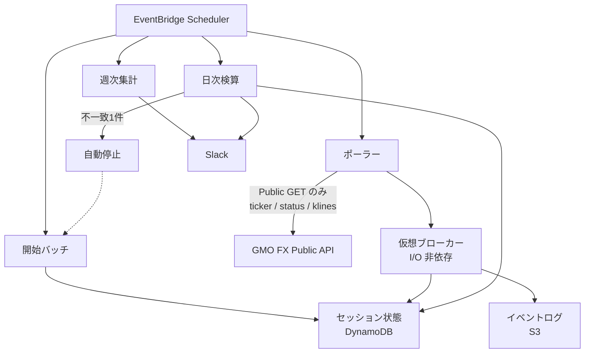
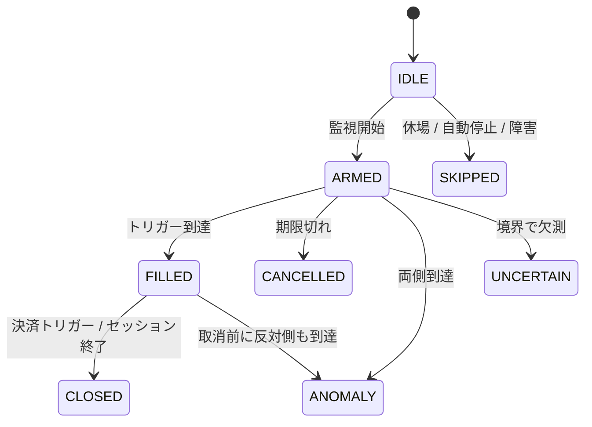

## TL;DR

- GMOコインFX API には注文を試し撃ちできるテスト環境がありません。そこで **発注系 POST を持たない執行観測デモ** を、AWS Lambda 上で動かしています
- 約定相当は **仮想ブローカー** が気配の時系列から記録します。判定コアは I/O 非依存で、ネットワークに触れるのは認証不要の Public GET だけです
- 当日の分足リプレイと **分類が1件でもずれたら自動停止** し、新規の仮想約定を出しません。ずれを残したまま走ると、記録そのものが証拠にならないためです

## 前提: システム概要と制約条件

GMOコインFX の API を使う自動売買システム(AWS Lambda + Python)です。同じ AWS アカウント上に実発注する別系統がありますが、**本記事の対象はデモ側**です。トレードの結果には触れません。

以降、本システム固有の言い方を3つ使います。

- **執行観測デモ**: 実発注せず、気配の時系列で約定相当を記録するサブシステム
- **仮想ブローカー**: 観測列を入力に状態を進める、I/O 非依存の状態機械
- **自動停止**: 日次検算で分類が不一致になったとき、翌セッションから新規の仮想約定を止めること。実装では `halt` フラグです

制約条件は次のとおりです。

- 発注系 POST(新規注文・取消・決済)は、一度サーバに届くと取り消せない副作用を持ちます。サンドボックスはないので(2026年8月時点、公式ドキュメント全文で確認)、デモの経路に発注を置きたくありません
- 既存の発注ゲート(独立した2つの環境変数が両方揃わないと実送信しない仕組み)は、**このデモの封じ込めには使いません**。ゲートの開閉と、デモが発注できないことは独立であるべきだと考えたためです。ゲート側の設計は[誤発注を封じ込める記事](https://zenn.dev/ozapon/articles/gmo-fx-order-containment)に書いています
- 合否は執行品質だけです。**シグナル一致率**、**稼働率**、**推定滑り**の3つです。トレードの結果は合否の入力に使いません

推定滑りは「トリガー価格と、到達した観測点の気配の差」です。実注文の滑りではありません。モックで測れるのは気配ベースの下界近似だ、という限界を先に書いておきます。

## 設計の全体像

デモは4つの定時バッチで1セッションを閉じます。すべて EventBridge Scheduler 起動の Lambda です。



流れは次のとおりです。

1. **開始バッチ**が当日のトリガー価格を置き、状態を `ARMED` にする。置けなければ `SKIPPED`
2. **ポーラー**が ticker を数秒間隔で取り、仮想ブローカーへ観測点を渡す
3. **日次検算**が独立した分足リプレイと分類を突合する。`mismatch` なら自動停止する
4. **週次集計**が稼働率と推定滑りの分布を出す。停止中なら継続日数も出す。サマリに載せるのは執行品質だけです

判定コアと HTTP クライアントは分けています。コアは観測列を受け取って状態を進めるだけです。`public_get` を呼ぶのはアダプタ1箇所で、CI がコアからクライアントへの import を禁止しています。

## 各要素の解説

### 仮想ブローカーは観測列だけで進む

状態は1セッション1レコードです。遷移は次の形です。



入力は `TickerObservation`(時刻・bid・ask・市場状態)の列です。永続化も Slack も、呼び出し側がイベントを消費します。コア単体でリプレイできることが、後述の日次検算の前提です。

抜粋は簡略化しています。終端では何もせず、開場でない気配は状態を進めません。

```python
TERMINAL = {"CLOSED", "SKIPPED", "CANCELLED", "ANOMALY", "UNCERTAIN", "IDLE"}

def apply_observation(session, obs):
    if session.state in TERMINAL:
        return session, []

    if obs.status != "OPEN":
        return session, [event(reason="market_closed", status=obs.status)]

    if session.state == "ARMED":
        return apply_armed(session, obs)
    if session.state == "FILLED":
        return apply_filled(session, obs)
    return session, []
```

`ANOMALY` は「監視中に両方向のトリガーへ同時に到達した」異常です。実発注なら片側取消の競合に相当するので、デモでは握りつぶさず記録します。`UNCERTAIN` は境界付近の欠測などで当日中に分類できない状態です。後述のとおり、これは不一致に数えません。

### ネットワークに触れるのは Public GET だけ

アダプタが使うのは `GET /public/v1/status`、`GET /public/v1/ticker`、`GET /public/v1/klines` です。いずれも認証不要です。Lambda の IAM には GMO のシークレット読み取りを付けていません。許可している `GetSecretValue` は Slack の webhook だけです。

```hcl
statement {
  sid       = "SlackWebhookSecretOnly"
  effect    = "Allow"
  actions   = ["secretsmanager:GetSecretValue"]
  resources = [var.slack_webhook_secret_arn]
}
```

Terraform の設定テキストから、取引系シークレット名と発注ゲート用の環境変数が現れないことを CI で固定しています。コメントで「渡さない」と書くのはよく、検査はコメントを除いた設定部分だけを見ます。

クライアントのメソッド自体は、資格情報が空でも呼び出せます。空シークレットで署名して 401 になるだけで、例外は送出しません。したがって封じ込めの根拠は「メソッドが無い」ことではなく、**参照がゼロであることと、IAM がシークレットを渡せないこと**です。

S3 への書き込みはデモ専用プレフィックスに限定し、DynamoDB も専用テーブルです。セッション状態と、別系統の冪等ロックが混ざらないようにしています。

### 閉場の ticker は統計を汚染する

気配を採用する前に、市場状態が `OPEN` であることを見ます。閉場中でも ticker は HTTP 200 を返し、エンベロープの `status` は 0(成功)でした。2026年8月の土曜に Public GET だけで実測しています。

```json
{"status": 0, "data": {"status": "CLOSE"}}
```

同じ応答の ticker 行は `status: "CLOSE"` で、価格は最終値のまま、スプレッドは開場時より大きく開いていました。`timestamp` だけは現在時刻に追随するので、時刻を見ても止まりに気付けません。

この気配を母集団に入れると、推定滑りの分布が汚染されます。開場ゲートを通過した観測だけを記録します。参照系 GET では開閉が分からない話は、[閉場なのに建玉取得が通った記事](https://zenn.dev/ozapon/articles/gmo-fx-market-status-closed)に分けてあります。こちらは Private GET の実測で、穴の型は同じです。

もう1点、エンベロープの `status`(API 成否の 0/1)と `data.status`(市場状態)は**同名で別物**です。GMO は業務エラーでも HTTP 200 + `{"status": 1, ...}` を返すため、エンベロープを見ないと `data` 欠落が `"UNKNOWN"` になり、呼び出し側が閉場と誤認します。

```python
def fetch_market_status(client) -> str:
    resp = client.public_get(PUBLIC_STATUS)
    raise_for_gmo_status(resp, context="public/status")
    data = resp.json().get("data", {})
    return str(data.get("status", "UNKNOWN"))
```

誤認がまずいのは、稼働率の数え方です。機会損失に計上するのは障害(`system_outage`)だけで、閉場は別理由です。API エラーを閉場に落とすと、その日が無通知で消えます。検算側も、klines の業務エラーでは自動停止せず `defer` を返します。比較材料が無いのに不一致を出さないよう、判定不能は安全側に倒します。

HTTP 200 でもボディの `status` を見る話は[約定が0件になった記事](https://zenn.dev/ozapon/articles/gmo-fx-http200-empty-executions)にあります。

### 進行中の足は捨てる

klines は、足が開いて数秒後から**進行中の足**を返します。閉じてからも OHLC は更新され、平日実測では最大で約5秒残っていました。開始バッチは確定足だけを使い、`openTime + interval <= now` で切ります。

確定遅延を見込んだ起動タイミングにしてあるので、ちょうど境界で読む設計にはしていません。それでも揃わない場合は短くリトライし、だめなら `system_outage` として稼働率に載せます。

### 日次検算は三値で、mismatch だけ自動停止する

日次検算は、ポーラーが書いた分類と、当日の分足で回した判定コアを突合します。リプレイ側の経路は開始バッチと同じに揃えます。揃えないと「経路差」と「本物のデータ経路バグ」が区別できません。

戻り値は三値です。

| 戻り値 | 意味 | 自動停止 |
|---|---|---|
| `match` | 一致、または既知のラベル差として一致扱い | しない |
| `mismatch` | 分類不一致、またはトリガー価格の不一致 | **する** |
| `defer` | 判定保留 | しない |

```python
def signals_match_replay(replay, demo) -> Literal["match", "mismatch", "defer"]:
    if demo_signal_class(demo) == "uncertain":
        return "defer"
    ...
```

自動停止しないものを先に固定しています。

- デモが `UNCERTAIN` → `defer`。欠測のあとリプレイ確定待ちであり、分類の誤りではない
- デモが意図的に仮想約定しなかった日(`halted` / 休場 / 閉場 / 障害 / 無効化) → 突合しない。リプレイは分足さえあればシグナルを出すため、比較すると必ずずれます
- 約定価格や終値の差 → 観測点定義の差として別欄に記録する。不一致に数えない
- 既に停止中の再通知 → しない。解除するまで毎夕鳴ると、安全弁がノイズになります

休場は実測で踏んでいます。カレンダー上は休みでも、取引所の分足が残ることがあります。リプレイは普通に判定を出し、デモは見送りにしています。この日を突合すると偽の不一致で自動停止するので、見送り理由を突合対象から外しました。

分類が合っていても、開始バッチが置いたトリガー価格がリプレイと違えば自動停止します。これはデータ経路のバグ(確定足フィルタや日付の切り出し)を想定しています。到達時刻がリプレイのバーに入るかは記録のみです。ポーリング解像度の問題であって、分類の誤りではないためです。

```python
if verdict == "mismatch":
    already = get_halt()
    set_halt(True, reason=f"verify_mismatch:{day}")
    if not already:
        alert(...)  # 新規の不一致だけ通知する
```

停止中は開始バッチが `SKIPPED(halted)` を書いて終わります。解除は原因を直してから手動です。日次が再通知しない副作用として、停止が続いていることは Slack の日次からは分かりません。週次サマリに停止の有無と継続日数を必ず載せ、解除忘れをそこで検知します。

### 合否は執行品質だけ見る

週次が見るのは次です。閾値超過は警告だけで、自動停止はしません。止めるのは日次の分類不一致だけです。

- シグナル一致率(日次検算の `mismatch` が0件)
- 稼働率(判定や記録が不能になった日)
- 推定滑りの分布(到達観測点のみ。母集団から除外する日は明示する)

推定滑りの集計には、セッション終了の差や両側到達の差を混ぜません。ブローカーがその差をエントリー価格基準で作ると、トリガーとの差ではなく値動きそのものが混ざります。不利方向を正に揃えてから分位を取ります。

真の滑りは実注文でしか測れません。ここで出しているのは気配の下界近似です。

### 起動の重なりは状態を汚す

ポーラーは1起動のなかで短時間ループします。起動間隔と実行時間を同じにすると、後発の起動が古い `ARMED` を読み、同じセッションを二重に約定判定し得ます。分類は両系列とも同じでも、記録に残る到達価格は「終端に先に着いた系列」の偶然になります。

対応は2つです。状態が変わったらその場で永続化する。エントリーは先着で確定する。同時実行そのものは抑止せず、終端状態と先着の組み合わせで後発が上書きしないようにしています。

汚染されたのは到達価格の母集団だけで、分類ラベルではなかった、という切り分けも検算側に残しています。「一致検証が通っている = その日の数値がすべて健全」ではありません。

### タイムゾーンは判定基準側に置く

セッションの判定基準は JST ではありません。EventBridge Scheduler の `ScheduleExpressionTimezone` に、判定基準の IANA タイムゾーンを指定します(2026年8月時点の[AWS 公式](https://docs.aws.amazon.com/scheduler/latest/UserGuide/schedule-types.html)。DST は Scheduler が自動調整する、とあります)。

JST 固定 cron を季節で差し替える案は採りません。切替忘れと、市場ごとの切替週のずれという失敗モードが新たに入るためです。ログのタイムスタンプは従来どおり UTC / JST を併記し、素の JST 時刻でセッションを近似することは禁止しています。

cron 式の書き方(開始値からの増分)はテストで固定しています。詳細は本記事の主役ではないので、枝の話に回します。

Public REST の呼び出し上限は、公式ドキュメントに明記がありません(2026年8月時点。明記があるのは Private GET / POST と WebSocket の subscribe)。下限1秒、既定5秒にし、流量制限を観測したら間隔を倍化します。既存クライアントの GET リミッターも併用します。レート制御の本体は[クライアント側で強制する記事](https://zenn.dev/ozapon/articles/gmo-fx-rate-limiter)です。

## 設計判断: 代替案とトレードオフ

### 案A: 既存の発注ゲートでデモも封じ込める → 不採用

環境変数を1系統に揃えれば、運用のスイッチは減ります。ただしゲートが開いた瞬間に、デモ側の「発注できない」も一緒に外れます。デモの存在理由は執行の観測なので、ゲートの開閉と独立に、**シークレットを持たず、発注経路を持たない**形にしました。

### 案B: Public WebSocket で気配を取る → 不採用

解像度では REST ポーリングより上です。ただし常時接続は、起動して終わる Lambda の前提と合いません。推定滑りに必要なのは分位の分布把握で、数秒間隔の REST で足りる、という判断です。接続維持と再接続の運用を増やす方が高いと考えました。

### 案C: JST の cron を季節でずらして近似する → 不採用

他の定時ジョブが JST だと、見た目の一貫性は得られます。失敗モードが「切替作業」に移るだけで、判定基準そのものは移動しません。IANA タイムゾーンを Scheduler に持たせる方が、DST の知識をアプリケーションから外せます。

### 案D: 不一致を記録して走り続ける → 不採用

自動停止せず、週次でまとめて判断する案です。運用は楽になります。しかし不一致の日が記録に混ざると、一致率も滑りも事後に信頼できません。デモの目的がパイプラインの正しさなら、ずれた時点で止める方が一貫します。価格の差や欠測は自動停止しない、と対象を狭くしたのは、この厳しさを保つためです。

### 案E: ポーラーと同じ観測列でリプレイする → 不採用

入力を揃えると実装は単純で、ポーラーのバグは自己参照では出ません。日次検算の意味は、**独立した分足**をオラクルにすることです。移植時のゴールデンテスト(過去日のキャッシュで判定コアがオラクルと完全一致すること)と、本番の観測経路がオラクルと一致することは、別の保証です。

## まとめ

このデモで先に閉じたかったのは、「発注しないこと」そのものより、**記録が証拠のまま残ること**です。既存の発注ゲートが閉じているあいだだけ観測しても、ゲートが開いた瞬間に前提が崩れます。だからデモ側の封じ込めは、ゲートの開閉から独立させました。

検算も同じです。ポーラー自身の観測で自分を採点すると、経路のバグは見えません。独立した分足と突き合わせ、分類がずれた日はそこで止めます。価格差や欠測まで止めると安全弁がノイズになるので、自動停止の対象は狭くしています。

予約型の系統で、発注する価格を誰が決めるかは[LLMに損切り価格を出させない設計](https://zenn.dev/ozapon/articles/gmo-fx-llm-sl-python)に書いています。誤発注の封じ込めは[テスト環境のない本番APIで誤発注を封じ込める設計](https://zenn.dev/ozapon/articles/gmo-fx-order-containment)、閉場判定は[閉場なのに建玉取得が通った話](https://zenn.dev/ozapon/articles/gmo-fx-market-status-closed)です。
